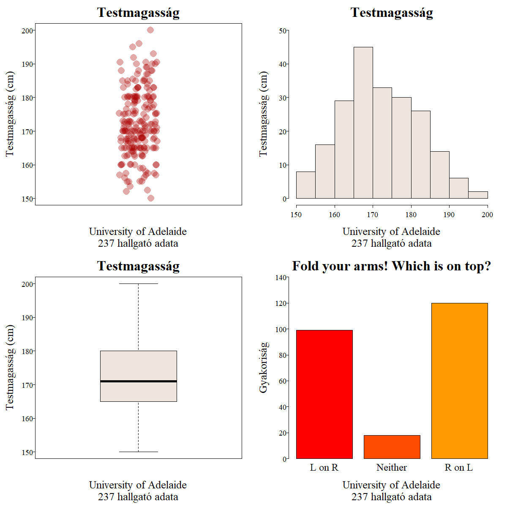

# Grafika az R-ben {#grafika-az-r-ben}


```{r results='asis', echo=FALSE, out.width = '70%'}
knitr::include_graphics(path = "images/ch_09_small.png")
```


```{block2, type='rmdlevel1'}

Ebben a fejezetben áttekintjük:
  
* az R grafikus rendszerei
* a hagyományos grafika alapfogalmai
* magasszintű és alacsonyszintű rajzfüggvények a hagyományos grafikában
* a ggplot2 rendszer alapelve
* ábrák létrehozása ggplot2-ben
* ábrák mentése háttértárra

```


Az R-ben több grafikus rendszer közül választhatunk, amikor az ábráink rajzolásához kezdünk. A hagyományos grafikus rendszer mellett elérhető az ún. grid grafikus rendszer, a trellis/lattice rendszer és a ggplot2 rendszer is. Az egyes rendszerek eltérő megközelítést használnak az ábrák létrehozásához, és természetesen különböző csomagok különböző függvényeit használják.

* A *hagyományos grafikus* rendszer az S nyelv grafikus rendszerének implementációja. A magasszintű grafikus függvények a komplett ábrák létrehozásért felelősek, az alacsony szintű függvényekkel pedig kisebb-nagyobb grafikus elemeket helyezhetünk a meglévő ábrára. Mindig "rárajzolunk" a meglévő elemekre, a későbbi módosításra vagy törlésre nincs lehetőségünk.

* A **grid** csomagból elérhető grafikus rendszer grafikus primitívek rendkívül gazdag tárháza. Segítségükkel grafikus objektumokat építhetünk, amelyek az ábrától független reprezentációval rendelkeznek, így azok később módosíthatók. A saját koorditáta-rendszerrel rendelkező viewport-ok rendszere tetszőlegesen bonyolult ábrák létrehozását segíti. A grid rendszer maga nem tartalmaz statisztikai rajzfüggvényeket, de számos, a grid csomagra épülő rendszer igen (pl. lattice és ggplot2).

* A **lattice** csomag grafikus rendszere az ún. trellis grafikus rendszer megvalósítása R-ben. A hagyományos grafikus rendszerhez képest rendkívül sok fejlesztést tartalmaz. A grid grafikus rendszerre épül, így hordozza annak rugalmasságát.

* A **ggplot2** csomag grafikus rendszere kísérletet tesz arra, hogy a hagyományos és a lattice grafikus rendszer előnyös tulajdonságait ötvözze. Szintén a grid rendszerre épül. A **ggplot2** csomag a Tidyverse R része, így a modern R grafikus megjelenítőjének is tekinthetjük. A többi felsorolt grafikus rendszer az Alap R része. 

Jelen könyvben csak ggplot2 grafikus rendszert ismertetjük.


## A modern grafika (ggplot2)

A ggplot2 grafika teljesen más megközelítést használ az ábrák létrehozásához, mint az Alap R garfikus rendszerei. Nevét Leland Wilkinson Grammar of Graphics könyve után kapta,amely a grafika általános formális és strukturált leírására tett kísérletet. A ggplot2 grafika a Hadley Wickham által készített **ggplot2** csomaggal érhető el. A ggplot2 ábrák létrehozása némi tanulás után átlátható és következetes lesz, maguk az elkészült grafikák gyönyörűek és alkalmasak azonnali publikására.

Egy ggplot2 grafika három összetevőn alapul:

* *adat*: A megjelenítés egy adattáblában alapul (tibble vagy data frame). Az adatoszlopok ennek megfelelően többnyire numerikus vektorok vagy faktorok.
* *megjelenés*: Az ábrán megjelenő elemek lehetséges paraméterei, például pont esetén az x és y koordináta, a szín, a méret vagy alak, oszlopok esetén például a magasság és kitöltő szín.
* *ábra elem*: Az ábrán megjelenő elemek, például pont, oszlop vagy vonal. Ezek határozzák meg végső soron az ábra típusát, így létrehozhatunk például pontdiagramot, oszlopdiagramot vagy hisztogramot, és vonal diagramot, de ezekből egy ábrán akár többet is felhasználhatunk.

Nézzünk egy egyszerű példát! Hozzunk létre egy pontdiagramot a következő paranccsal: 

```{r eval=FALSE}
ggplot(data=d.tbl, mapping=aes(x=pont.1, y=pont.2)) + geom_point()
```

A legtöbb ggplot2 ábra létrehozása a `ggplot()` függvénnyel indul, ahol a `data=` argumentum az *adat* részt tartalmazza, a `mapping=` argumentum pedig *megjelenés* paramétereit sorolja fel. Ehhez az `aes()` függvénnyt használjuk, amely adatoszlopok és a megjelenéshez tartozó paraméterek közötti kapcsolatot is megadja egyben. Az *ábra elemeit* `+` operátorral adjuk hozzá a `ggplot()` függvényhez, ez most a pontelemeket létrehozó `geom_point()`.

A fenti parancs *adat* része egy 3 sorból és 4 oszlopból álló adattábla, amely egy karakteres (`csoport`) és három numerikus oszlopot (`pont.1`, `pont.2`, `pont.3`) tartalmaz.


```{r fig.asp=.35}
library(tibble)
d.tbl <- tribble(
  ~csoport, ~pont.1, ~pont.2, ~pont.3,
  "AA", 15, 42, 12, 
  "BB", 20, 28, 18,
  "CC", 35, 12, 21
)
```


Az ábra létrehozásához a `ggplot()` függvényt és a pontelemek hozzáadásához a `geom_point()` függvényt használjuk, az utóbbiban nincs is szükség argzmentumok megadására. A `ggplot()` első argumentuma a `data=d.tbl`, amely az adatösszetevőt tisztázza, a `mapping=` argumentumban az `aes()` függvényben az x és y megjelenítési paraméterekről gondoskodunk, a `pont.1` és `pont.2` oszlopok megadásával. Az x és y megjelenési paraméterek természetesen a hozzáadott pontok x és y koordinátáira vonatkoznak.


Természetesen a pontelemek helyett használhatunk oszlopelemeket is a `geom_col()` segítségével, itt az x és y megjelenítési paraméterek az oszlop x koordinátáját és az oszlop magasságát jelentik. 

```{r eval=FALSE}
ggplot(data=d.tbl, mapping=aes(x=pont.1, y=pont.2)) + geom_col()
```

Ha a `geom_line()` ábraelemeket adjuk az ábrához, akkor az x és y paraméterek a vonalak létrehozásához használt pontok x és y koordinátái.

```{r eval=FALSE}
ggplot(data=d.tbl, mapping=aes(x=pont.1, y=pont.2)) + geom_line()
```

Egyetlen ábrán akár mindhárom ábraelem (pont, oszlop, vonal) is megjelenhet:

```{r eval=FALSE}
ggplot(data=d.tbl, mapping=aes(x=pont.1, y=pont.2)) + geom_point() + geom_col() + geom_line()
```

```{r echo=FALSE, fig.align="center", fig.width=8, fig.height=2}
library(ggplot2)
library(gridExtra)
p1 <- ggplot(data=d.tbl, mapping=aes(x=pont.1, y=pont.2)) + geom_point()
p2 <- ggplot(data=d.tbl, mapping=aes(x=pont.1, y=pont.2)) + geom_col()
p3 <- ggplot(data=d.tbl, mapping=aes(x=pont.1, y=pont.2)) + geom_line()
p4 <- ggplot(data=d.tbl, mapping=aes(x=pont.1, y=pont.2)) + geom_point() + geom_col() + geom_line()
grid.arrange(p1, p2, p3, p4, ncol=4)
```

```{r}
library(ggpubr)
# Load data
data("ToothGrowth")
df <- ToothGrowth

# Basic plot with summary statistics: mean_se
# +++++++++++++++++++++++++++
# Change point shapes by groups: "dose"
ggstripchart(df, x = "dose", y = "len",
   shape = "dose", size = 3,
   add = "mean_se")

# Use mean_sd
# Change error.plot to "crossbar"
ggstripchart(df, x = "dose", y = "len",
   shape = "dose", size = 3,
   add = "mean_sd", add.params = list(width = 0.5),
   error.plot = "crossbar")


# Add summary statistics
# ++++++++++++++++++++++++++

# Add box plot
ggstripchart(df, x = "dose", y = "len",
 shape = "dose", add = "boxplot")

# Add violin + mean_sd
ggstripchart(df, x = "dose", y = "len",
 shape = "dose", add = c("violin", "mean_sd"))


# Change colors
# +++++++++++++++++++++++++++
# Change colors by groups: dose
# Use custom color palette
 ggstripchart(df, "dose", "len",  shape = "dose",
   color = "dose", palette = c("#00AFBB", "#E7B800", "#FC4E07"),
   add = "mean_sd")


# Plot with multiple groups
# +++++++++++++++++++++
# Change shape and color by a second group : "supp"
ggstripchart(df, "dose", "len", shape = "supp",
  color = "supp", palette = c("#00AFBB", "#E7B800"))

# Adjust point position
ggstripchart(df, "dose", "len", shape = "supp",
  color = "supp", palette = c("#00AFBB", "#E7B800"),
  position = position_dodge(0.8) )

# You can also use position_jitterdodge()
# but fill aesthetic is required
ggstripchart(df, "dose", "len",  shape = "supp",
   color = "supp", palette = c("#00AFBB", "#E7B800"),
   position = position_jitterdodge() )

# Add boxplot
ggstripchart(df, "dose", "len", shape = "supp",
 color = "supp", palette = c("#00AFBB", "#E7B800"),
 add = "boxplot", add.params = list(color = "black") )


```

Az eddigiek alapján világos, hogy a megjelenési paraméterek 

Ábra elemek (`geom_*` függvény) | Kötelező megjelenési paraméter | Opcionális megjelenési paraméter
--------------------------------|--------------------------------|---------------------------------
`geom_abline()`  | `slope`, `intercept` | `alpha`, `color`, `linetype`, `size`
`geom_hline()` | `yintercept` |  `alpha`, `color`, `linetype`, `size`
`geom_vline()` | `xintercept` |  `alpha`, `color`, `linetype`, `size`
`geom_area()`  |  `x`, `ymin`, `ymax` | `alpha`, `colour`, `fill`, `group`, `linetype`, `size`
`geom_col()`  |  `x`, `y` | `alpha`, `colour`, `fill`, `group`, `linetype`, `size`
`geom_bar()`  |  `x`, `y` | `alpha`, `colour`, `fill`, `group`, `linetype`, `size`
`geom_boxplot()`  | `x`, `lower`, `middle`, `upper`, `ymax`, `ymin`) | `alpha`, `color`, `fill`, `group`, `linetype`, `shape`, `size`, `weight`
`geom_density()`  |  `x`, `y` | `alpha`, `color`, `fill`, `group`, `linetype`, `size`, `weight`
`geom_dotplot()`  |  `x`, `y` | `alpha`, `color`, `fill`, `group`, `linetype`, `stroke`
`geom_histogram()`  |  `x` | `alpha`, `color`, `fill`, `linetype`, `size`, `weight`
`geom_jitter()`  |  `x`, `y` | `alpha`, `color`, `fill`, `shape`, `size`
`geom_line()`  |  `x`, `y` | `alpha`, `color`, `linetype`, `size`
`geom_point()`  |  `x`, `y` | `alpha`, `color`, `fill`, `shape`, `size`
`geom_ribbon()`  | `x`, `ymax`, `ymin` |  `alpha`, `color`, `fill`, `linetype`, `size`
`geom_smooth()`  | `x`, `y` | `alpha`, `color`, `fill`, `linetype`, `size`, `weight`
`geom_text()`  | `label`, `x`, `y` | `alpha`, `angle`, `color`, `family`, `fontface`, `hjust`, `lineheight`, `size`, `vjust`


Más megjelenési paraméterekre is lehetünk hatással. Ha a szín és a pontméret jellemzőket is be akarjuk állítani, akkor az `aes()` függvényben a `colour=` és a `size=` argumentumoknak az adattábla egy-egy oszlopát kell megadnunk. Ilyen esetkben jelmagyarázat is megjelenik, amelynek az alapértelmezett pozícióját most expliciten is kiírtuk: `theme(legend.position = "right")`.

```{r fig.align="center", fig.width=8, fig.height=3}
library(ggplot2)
library(gridExtra)
p1 <- ggplot(d.tbl, aes(x=pont.1, y=pont.2, colour=csoport)) + geom_point() + theme(legend.position = "right")
p2 <- ggplot(d.tbl, aes(x=pont.1, y=pont.2, colour=csoport, size=pont.3)) + geom_point() + theme(legend.position = "right")
grid.arrange(p1, p2, ncol=2)
```


Oszlopdiagram esetén használhatjuk a `fill=` vagy az `alpha=` argumentumokat, amelyekkel az egyes oszlopok kitöltőszínét és átlátszóságát tudjuk beállítani:


```{r fig.align="center", fig.width=8, fig.height=3}
p1 <- ggplot(d.tbl, aes(x=csoport, y=pont.2, fill=csoport)) + geom_col()
p2 <- ggplot(d.tbl, aes(x=csoport, y=pont.2, fill=csoport, alpha=pont.3)) + geom_col()
grid.arrange(p1, p2, ncol=2)
```

Néhány ábraelem esetében azonban nem ilyen egyértelmű az `aes()` függvényben megadott oszlopvektorok és a ábraelem megjelenési paramétere közötti összefüggés.

Tekintsük például a dobozdiagramot, amelyben a fenti táblázat szerint a `geom_boxplot()` ábraelem ígényli az˛`x`, `lower`, `middle`, `upper`, `ymax`, `ymin` megjelenési paraméterek beállítását. Azonban a lenti árákat sokkal egyszerűbb `aes()` paraméterezéssel hoztuk létre, szó sincs benne a fent felsoroltak megadásáról.


```{r fig.align="center", fig.width=9, fig.height=3}
data(survey, package = "MASS")
data.file <- "https://github.com/abarik/rdata/raw/master/r_alapok/metacritic_games.csv"

d.tbl <- read_delim(file = data.file, delim = ",")
d.tbl <- d.tbl %>% select(game, platform, genre, rating, metascore, user_score)
d.tbl

p1 <- ggplot(d.tbl, aes(y=user_score)) + geom_boxplot() 
p2 <- ggplot(na.omit(d.tbl), aes(x=rating, y=user_score)) + geom_boxplot()
p3 <- ggplot(na.omit(d.tbl), aes(x=rating, y=user_score, fill=platform)) + geom_boxplot(outlier.shape = NA) + theme(legend.position = "top")
grid.arrange(p1, p2, p3, ncol=3)
```


A kötelező megjelenési paramétereket a `geom_boxlot()` által meghívott `stat_boxplot()` függvény biztosítja, így nekünk ezekről nem kell gondoskodni, elegendő egyetlen numerikus vektort (`y=user_score`) vagy egy kategorikus és egy numerikus vektort (`x=rating, y=user_score`) megadni az `aes()` függvényben. 

Léteznek tehát olyan grafikus elemek, amelyek változtatás nélkül képesek a bemenő adatok alapján a megjelenítési paramétereket beállítani, és léteznek olyanok is, amelyek a bemenő adatokat áttranszformálják egy köztes adattáblába, és a megjelnési paraméterek konkrét értékét innen veszik. A következő táblázat ezeket a statisztikai transzformációkat foglalja össze, csak azokat az ábraelemeket soroljuk fel, ahol történik transzformáció:


Ábraelem | Transzformáció | Létrehozott változók
---------|----------------|--------------------------
geom_boxplot() | stat_boxplot() | width, ymin, lower, notchlower, middle, notchupper, upper, ymax
geom_bar() | stat_count() | count, prop
geom_density() | stat_density() | density, count, scaled, ndensity
geom_histogram() és geom_freqpoly | stat_bin() | count, density, ncount, ndensity
geom_violin() |  stat_ydensity() | density, scaled, count, violinwidth, n, width
geom_smooth() | stat_smooth() | y, ymin, ymax, se


```{r}
# egyezes <- d.tbl$platform
# tbl <- data.frame(egyezes=egyezes)
# ggplot(tbl, aes(x=egyezes, group=1)) + geom_bar(aes(y = ..count..)) +
#   geom_text(aes( label = scales::percent(..prop..), y= ..prop.. ), stat= "count",  vjust = -.5) +
#   scale_y_continuous(labels = scales::percent) +
#   coord_cartesian(ylim = c(0, 1101)) + labs(x="Egyező gének száma", y="Előfordulás")
# 
# 
# ggplot(d.tbl, aes(x=factor(platform), y=user_score)) + geom_boxplot() +
#   geom_text(aes(label = scales::percent(..lower..)), stat= "boxplot",  vjust = -.5) 

library("ggpubr")
library(ggthemes)
# Load data
data("mtcars")
df <- mtcars
df$cyl <- as.factor(df$cyl)
head(df[, c("wt", "mpg", "cyl")], 3)


# +++++++++++++++++++++++++++++++

df <- data.frame(
 group = c("Male", "Female", "Child"),
  value = c(25, 25, 50))

head(df)


# Basic pie charts
# ++++++++++++++++++++++++++++++++

ggpie(df, "value", label = "group")


# Change color
# ++++++++++++++++++++++++++++++++

# Change fill color by group
# set line color to white
# Use custom color palette
 ggpie(df, "value", label = "group",
      fill = "group", color = "white",
       palette = c("#00AFBB", "#E7B800", "#FC4E07") )


# Change label
# ++++++++++++++++++++++++++++++++

# Show group names and value as labels
labs <- paste0(df$group, " (", df$value, "%)")
ggpie(df, "value", label = labs,
   fill = "group", color = "white",
   palette = c("#00AFBB", "#E7B800", "#FC4E07"))

# Change the position and font color of labels
ggpie(df, "value", label = labs,
   lab.pos = "in", lab.font = "white",
   fill = "group", color = "white",
   palette = c("#00AFBB", "#E7B800", "#FC4E07"))


```


```{r include=FALSE, eval=FALSE}
ggplot(d.tbl) +
  geom_bar(aes(y = pont.1, x = csoport, fill = csoport), stat = "identity") +
  theme() +
  coord_polar("x", start = 0)
```


A következő példákhoz a következő csomagok betöltésére van szükség:

```{r}
library(tidyverse)
library(ggplot2)
library(gridExtra)
library(ggthemes)
library(RColorBrewer)
```


```{r echo=FALSE, fig.align="center", fig.width=9, fig.height=15}
data(survey, package = "MASS")

survey$Smoke <- factor(survey$Smoke, levels=c("Never", "Occas", "Regul", "Heavy"))
survey$Exer <- factor(survey$Exer, levels=c("None", "Some", "Freq"))

p1 <- ggplot(na.omit(survey), aes(x=Smoke, y=Pulse, fill=Smoke)) + geom_boxplot() + labs(title="Dobozdiagram", subtitle = "geom_boxplot()") + theme_fivethirtyeight() + theme(legend.position = "none")

p2 <- ggplot(na.omit(survey), aes(x=Smoke, y=Pulse, fill=Smoke)) + geom_violin() + labs(title="Hegedűdiagram", subtitle = "geom_violin()") + theme_fivethirtyeight() + theme(legend.position = "none")

p3 <- ggplot(na.omit(survey), aes(x=Smoke, y=Pulse, colour=Smoke)) + geom_jitter() + labs(title="Pontdiagram (1D)", subtitle = "geom_jitter()") + theme_fivethirtyeight() + theme(legend.position = "none")

p4 <- ggplot(na.omit(survey), aes(x=Pulse, fill=Smoke)) + geom_dotplot(binwidth = 2.5) + labs(title="Dotplot", subtitle = "geom_dotplot()") + theme_fivethirtyeight() + theme(legend.position = "none")

p5 <- ggplot(na.omit(survey), aes(x=Smoke, fill=Smoke)) + geom_bar() + labs(title="Oszlopdiagram", subtitle = "geom_bar() vagy geom_col()") + theme_fivethirtyeight() + theme(legend.position = "none")

p6 <- ggplot(na.omit(survey), aes(x=Height, y=Wr.Hnd, colour=Sex)) + geom_point() + geom_smooth(se = F, method = "lm") + labs(title="Pontdiagram (2D)", subtitle = "geom_point() és geom_smooth()") + theme_fivethirtyeight() + theme(legend.position = "none")

p7 <- ggplot(data=survey, aes(x=Height)) + 
        geom_histogram( binwidth=4, colour = "blue", fill = "lightblue") + labs(title="Hisztogram", subtitle = "geom_histogram()") + theme_fivethirtyeight() + theme(legend.position = "none")

p8 <- ggplot(data=survey, aes(x=Height, colour=Exer, linetype=Sex)) + 
        geom_freqpoly(binwidth=4, size=1.2) + labs(title="Gyakorisági görbe", subtitle = "geom_freqpoly()") + theme_fivethirtyeight() + theme(legend.position = "none")

p9 <- ggplot(data=survey, aes(x=Height, fill = Exer)) + geom_density(alpha=0.2, size=0.7) + labs(title="Simított hisztogram", subtitle = "geom_density()") + theme_fivethirtyeight() + theme(legend.position = "none")

p10 <- ggplot(data=survey[!is.na(survey$Exer) & !is.na(survey$Sex),], 
             aes(x=Exer, y=Pulse, fill=Sex)) + 
        stat_summary(fun.y=mean, geom="point", position=position_dodge(width=0.90), colour="black") + 
        stat_summary(fun.data=mean_cl_normal, geom="errorbar", 
                     position=position_dodge(width=0.90), width=0.11) +
        scale_fill_manual("Sex",values = c("Female"="#bccdff", "Male"="#81a1ff")) + 
        coord_cartesian(ylim = c(30, 100)) + labs(title="Errorbar", subtitle = "geom_error() és geom_point()") + theme_fivethirtyeight() + theme(legend.position = "none")


# Lollipop ---------------------
cty_mpg <- aggregate(mpg$cty, by=list(mpg$manufacturer), FUN=mean)  # aggregate
colnames(cty_mpg) <- c("make", "mileage")  # change column names
cty_mpg <- cty_mpg[order(cty_mpg$mileage), ]  # sort
cty_mpg$make <- factor(cty_mpg$make, levels = cty_mpg$make)  # to retain the order in plot.
p11 <- ggplot(cty_mpg, aes(x=make, y=mileage)) + 
  geom_point(size=3) + 
  geom_segment(aes(x=make, 
                   xend=make, 
                   y=0, 
                   yend=mileage))  + labs(title="Lollipop ábra", subtitle = "geom_segment() és geom_point()") + theme_fivethirtyeight() + theme(legend.position = "none") +  theme(axis.text.x = element_text(angle=65, vjust=0.6))


library(gcookbook) # Load gcookbook for the climate data set
library(dplyr)

# Grab a subset of the climate data
climate_mod <- climate %>%
  filter(Source == "Berkeley") %>%
  select(Year, Anomaly10y, Unc10y)

# With a dotted line for upper and lower bounds
p12 <- ggplot(climate_mod, aes(x = Year, y = Anomaly10y)) +
  geom_line(aes(y = Anomaly10y - Unc10y), colour = "grey50", linetype = "dotted") +
  geom_line(aes(y = Anomaly10y + Unc10y), colour = "grey50", linetype = "dotted") +
  geom_line() + labs(title="Vonaldiagram", subtitle = "geom_line()") + theme_fivethirtyeight() + theme(legend.position = "none")


library(gcookbook)  # Load gcookbook for the uspopage data set

# Create the base plot
p13 <- ggplot(uspopage, aes(x = Year, y = Thousands, fill = AgeGroup)) +
  geom_area() +  labs(title="Területdiagram", subtitle = "geom_area()") + theme_fivethirtyeight() + theme(legend.position = "none")


p14 <- ggplot(data=survey, aes(sample=Height, colour=Sex)) + stat_qq() + labs(title="QQ-ábra", subtitle = "stat_qq() és stat_qq_line()") + theme_fivethirtyeight() + theme(legend.position = "none") + stat_qq_line()

p15 <- ggplot(data=survey, aes(x=Height)) + stat_ecdf(geom = "step") + labs(title="Eloszlásdiagram", subtitle = "stat_ecdf()") + theme_fivethirtyeight() + theme(legend.position = "none")


grid.arrange(p1, p2, p3, p4, p5, p6, p7, p8, p9, p10, p11, p12, p13, p14, p15, ncol=3)

```


### Dobozdiagram

```{r fig.asp=.35, fig.width=8, fig.align="center"}
data.file <- "https://github.com/abarik/rdata/raw/master/r_alapok/metacritic_games.csv"

d.tbl <- read_delim(file = data.file, delim = ",")
d.tbl <- d.tbl %>% select(game, platform, genre, rating, metascore, user_score)
d.tbl

p1 <- ggplot(d.tbl, aes(x=platform, y=user_score)) + geom_boxplot()
p2 <- ggplot(d.tbl, aes(x=platform, y=user_score, fill=platform)) + geom_boxplot() + theme(legend.position = "none")
p3 <- ggplot(na.omit(d.tbl), aes(x=platform, y=user_score, fill=rating)) + geom_boxplot(outlier.size = 0) + theme(legend.position = "top")
grid.arrange(p1, p2, p3, ncol=3)
```


```{r}
library(gcookbook)  # Load gcookbook for the pg_mean data set
ggplot(pg_mean, aes(x = group, y = weight)) +
  geom_col()
```


```{r}
data.file <- "https://github.com/abarik/rdata/raw/master/r_alapok/metacritic_games.csv"

d.tbl <- read_delim(file = data.file, delim = ",")
d.tbl <- d.tbl %>% select(game, platform, genre, metascore, user_score)
d.tbl


ggplot(data=d.tbl, aes(x=1, y=user_score)) + geom_point()
ggplot(data=d.tbl, aes(x=1, y=user_score)) + geom_jitter() 


ggplot(data=d.tbl, aes(x=metascore, y=user_score)) + geom_point()
ggplot(data=d.tbl, aes(x=platform, y=user_score)) + geom_jitter() 
ggplot(data=d.tbl, aes(x=platform, y=user_score)) + geom_jitter(alpha=0.3) + geom_boxplot(alpha=0.8, col="red") 


```


```{r}
library(fivethirtyeight)
ggplot(hate_crimes, aes(x = share_vote_trump, y = hate_crimes_per_100k_splc)) +
  geom_text(aes(label = state_abbrev)) +
  geom_smooth(se = FALSE, method = "lm") +
  labs(x = "Proportion of votes for Donald Trump",
       y = "Hate crimes per 100k during Nov 9-18, 2016 (SPLC)",
       title = "Relationship between Trump support & hate crimes")
```


```{r include=FALSE, eval=FALSE}
data("steak_survey", package = "fivethirtyeight")


p0 <- ggplot(data=na.omit(steak_survey), aes(x=steak_prep, fill=steak_prep)) + geom_bar(col="black") + ylim(c(0,140)) + coord_flip() + labs(title="Hogyan szereti a steaket?", x="", y="") + guides(fill=FALSE) + scale_fill_manual(values = rev(brewer.pal(11,"BrBG")[1:5])) + geom_text(aes(label=scales::percent(..count../sum(..count..), accuracy = 1)), stat='count', hjust=-0.3)


p1 <- p0 + labs(subtitle = "alapértelmezés")
p2 <- p0 + theme_bw() + labs(subtitle = "theme_bw()")
p3 <- p0 + theme_classic() + labs(subtitle = "theme_classic()")
p4 <- p0 + theme_dark() + labs(subtitle = "theme_dark()")
p5 <- p0 + theme_gray() + labs(subtitle = "theme_gray()")
p6 <- p0 + theme_light() + labs(subtitle = "theme_light()")
p7 <- p0 + theme_minimal() + labs(subtitle = "theme_minimal()")
p8 <- p0 + theme_calc() + labs(subtitle = "theme_calc()")
p9 <- p0 + theme_clean() + labs(subtitle = "theme_clean()")
p10 <- p0 + theme_economist() + labs(subtitle = "theme_economist()")
p11 <- p0 + theme_economist_white() + labs(subtitle = "theme_economist_white()")
p12 <- p0 + theme_excel() + labs(subtitle = "theme_excel()")
p13 <- p0 + theme_excel_new() + labs(subtitle = "theme_excel_new()")
p14 <- p0 + theme_few() + labs(subtitle = "theme_few()")
p15 <- p0 + theme_fivethirtyeight() + labs(subtitle = "theme_fivethirtyeight()")
p16 <- p0 + theme_gdocs() + labs(subtitle = "theme_gdocs()")
p17 <- p0 + theme_hc() + labs(subtitle = "theme_hc()")
p18 <- p0 + theme_igray() + labs(subtitle = "theme_igray()")
p19 <- p0 + theme_map() + labs(subtitle = "theme_map()")
p20 <- p0 + theme_pander() + labs(subtitle = "theme_pander()")
p21 <- p0 + theme_solarized() + labs(subtitle = "theme_solarized()")
p22 <- p0 + theme_solarized_2() + labs(subtitle = "theme_solarized_2()")
p23 <- p0 + theme_solid() + labs(subtitle = "theme_solid()")
p24 <- p0 + theme_stata() + labs(subtitle = "theme_stata()")
p25 <- p0 + theme_tufte() + labs(subtitle = "theme_tufte()")
p26 <- p0 + theme_wsj() + labs(subtitle = "theme_wsj()")
p27 <- p0 + theme_foundation() + labs(subtitle = "themes_foundation()")


p.all <- grid.arrange(p1, p2, p3, p4, p5, p6, p7, p8, 
             p9, p10, p11, p12, p13, p14, p15, p16,
             p17, p18, p19, p20, p21, p22, p23, p24, p25, p26, p27,
             nrow=14, ncol=2)

ggsave(filename = "themes_all.png", plot = p.all, width = 10, height = 27)

```


>1. feladat. Hisztogram.   
Rajzoljunk hisztogramot a MASS csomag survey adattáblájának Height oszlopára! Vessük össze a normális eloszlás sűrűségfüggvényével is!

### Hisztogram rajzolása


```{r fig.asp=.35}
data(survey, package = "MASS") # a survey beolvasása

# p1 - alapértelmezett hisztogram 
p1 <- ggplot(data=survey, aes(x=Height)) + geom_histogram()

# p2 - hisztogram: binwidth=2
p2 <- ggplot(data=survey, aes(x=Height)) + geom_histogram(binwidth=2)

# p3 - hisztogram: binwidth=4 és színek beállítása
p3 <- ggplot(data=survey, aes(x=Height)) + 
        geom_histogram( binwidth=4, colour = "blue", fill = "white")

# a fenti ábrák megjelenítése
grid.arrange(p1, p2, p3, ncol=3)
```


### Gyakorisági poligon, simított hisztogram és összevetés a normális eloszlás sűrűségfüggvényével

```{r fig.asp=.35}
data(survey, package = "MASS") # a survey beolvasása

# p1 - hisztogram és gyakorisági poligon
p1 <- ggplot(data=survey, aes(x=Height)) + 
        geom_histogram(colour = "blue", fill = "white", binwidth=4) + 
        geom_freqpoly(binwidth = 4, size=1, colour="blue")

# p2 - hisztogram és a normális eloszlás sűrűségfüggvénye
p2 <- ggplot(data=survey, aes(x=Height)) + 
        geom_histogram(aes(y = ..density..), colour="blue", fill="white", binwidth=4) + 
        stat_function(fun=dnorm, args = list(mean=mean(survey$Height, na.rm=T),
                                             sd=sd(survey$Height, na.rm = T)), 
                      colour="red", size=1)

# p3 - simított hisztogram és a normális eloszlás sűrűségfüggvénye
p3 <- ggplot(data=survey, aes(x=Height)) + 
        geom_density(colour="blue") + 
        stat_function(fun=dnorm, args = list(mean=mean(survey$Height, na.rm=T),
                                             sd=sd(survey$Height, na.rm = T)), 
                      colour="red", size=1)

# a fenti ábrák megjelenítése
grid.arrange(p1, p2, p3, ncol=3)
```


> 2. feladat. Hisztogram csoportokra.   
Rajzoljunk hisztogramot a MASS csomag survey adattáblájának Height oszlopára az Exer különböző csoportjaiban!

### Hisztogram csoportokra

```{r fig.asp=.35}
data(survey, package = "MASS") # a survey beolvasása

# p1 - hisztogramok egymás alá
p1 <- ggplot(data=survey[!is.na(survey$Exer),], aes(x=Height)) + 
        geom_histogram(colour = "blue", fill = "white", binwidth=4) + 
        facet_wrap(~ Exer, nrow = 3)

# p2 - hisztogramok táblázatszerűen
p2 <- ggplot(data=survey[!is.na(survey$Exer),], aes(x=Height)) + 
        geom_histogram(colour = "blue", fill = "white", binwidth=4) + 
        facet_wrap(~ Exer, nrow = 2)

# a fenti ábrák megjelenítése
grid.arrange(p1, p2, ncol=2)
```


### Gyakorisági poligon és simított hisztogram csoportokra, de egy ábrán

```{r fig.asp=.35}
data(survey, package = "MASS") # a survey beolvasása

# p1 - gyakorisági poligonok egy ábrán
p1 <- ggplot(data=survey[!is.na(survey$Exer),], aes(x=Height, y=..density.., colour = Exer)) + 
        geom_freqpoly(binwidth = 4, size=0.7) + theme(legend.position="top")

# p2 - simított hisztogramok egy ábrán
p2 <- ggplot(data=survey, aes(x=Height, colour = Exer)) + geom_density(size=0.7) +
        theme(legend.position="top")

# p3 - simított hisztogram kitöltéssel egy ábrán
p3 <- ggplot(data=survey, aes(x=Height, fill = Exer)) + geom_density(alpha=0.2, size=0.7) + 
        theme(legend.position="top")

# a fenti ábrák megjelenítése
grid.arrange(p1, p2, p3, ncol=3)
```


> 3. feladat. Dobozdiagram.   
Rajzoljunk hisztogramot a MASS csomag survey adattáblájának Pulse oszlopára a Smoke egyes csoportjaiban, valamint vegyük figyelembe a Sex változó értékeit is!

```{r fig.asp=.35}
data(survey, package = "MASS") # a survey beolvasása

# p1 - dobozdiagram a Smoke csoportjaira
p1 <- ggplot(data=survey[!is.na(survey$Smoke),], aes(x=Smoke, y=Pulse, fill=Smoke)) + 
        geom_boxplot() + theme(legend.position="top")

# p2 - dobozdiagram a Smoke csoportjaira a Sex figyelembevételével
p2 <- ggplot(data=survey[!is.na(survey$Smoke) & !is.na(survey$Sex),], 
             aes(x=Smoke, y=Pulse, fill=Smoke)) + 
        geom_boxplot() + guides(fill=FALSE) + facet_wrap(~ Sex, nrow = 1)

# a fenti ábrák megjelenítése
grid.arrange(p1, p2, ncol=2)
```


> 4. feladat. Átlagok ábrázolása.   
Rajzoljunk hisztogramot a MASS csomag survey adattáblájának Height oszlopára!

### Átlagok egy faktor esetén


```{r fig.asp=.35}
data(survey, package = "MASS") # a survey beolvasása

# p1 - oszlopdiagram az átlagokra 95%-os konfidencia intervallummal I.
p1 <- ggplot(data=survey[!is.na(survey$Smoke),], aes(x=Smoke, y=Pulse)) + 
        stat_summary(fun.y=mean, geom="bar", fill="white", colour="black") + 
        stat_summary(fun.data=mean_cl_normal, geom="pointrange") +
        coord_cartesian(ylim = c(0, 100)) 

# p2 - oszlopdiagram az átlagokra 95%-os konfidencia intervallummal II.
p2 <- ggplot(data=survey[!is.na(survey$Smoke),], aes(x=Smoke, y=Pulse)) + 
        stat_summary(fun.y=mean, geom="bar", fill="#95b0ff", colour="black") + 
        stat_summary(fun.data=mean_cl_normal, geom="errorbar", width=0.2) +
        coord_cartesian(ylim = c(0, 100)) 

# p3 - vonaldiagram az átlagokra 95%-os konfidencia intervallummal
p3 <- ggplot(data=survey[!is.na(survey$Smoke),], aes(x=Smoke, y=Pulse)) + 
        stat_summary(fun.y=mean, geom="point") + 
        stat_summary(fun.y=mean, geom="line", aes(group=1), colour="blue", linetype="dashed") + 
        stat_summary(fun.data=mean_cl_normal, geom="errorbar", width=0.2) +
        coord_cartesian(ylim = c(0, 100)) 

# a fenti ábrák megjelenítése
grid.arrange(p1, p2, p3, ncol=3)
```

### Átlagok két faktor esetén

```{r fig.asp=.35}
data(survey, package = "MASS") # a survey beolvasása

# p1 - oszlopdiagram az átlagokra 95%-os konfidencia intervallummal I.
p1 <- ggplot(data=survey[!is.na(survey$Exer) & !is.na(survey$Sex),], 
             aes(x=Exer, y=Pulse, fill=Sex)) + 
        stat_summary(fun.y=mean, geom="bar", position="dodge", colour="black") + 
        stat_summary(fun.data=mean_cl_normal, geom="errorbar", 
                     position=position_dodge(width=0.90), width=0.2) +
        scale_fill_manual("Sex",values = c("Female"="#bccdff", "Male"="#81a1ff")) + 
        coord_cartesian(ylim = c(0, 100)) + theme_bw() + 
        theme(legend.justification=c(1,0),legend.position=c(1,0),  
              legend.direction="horizontal")  

# p2 - oszlopdiagram az átlagokra 95%-os konfidencia intervallummal II.
p2 <- ggplot(data=survey[!is.na(survey$Exer) & !is.na(survey$Sex),], 
             aes(x=Exer, y=Pulse)) + 
        stat_summary(fun.y=mean, geom="bar", fill="#95b0ff", colour="black") + 
        stat_summary(fun.data=mean_cl_normal, geom="errorbar", width=0.2) +
        coord_cartesian(ylim = c(0, 100)) +
        facet_wrap(~ Sex, nrow = 1)

# p3 - vonaldiagram az átlagokra 95%-os konfidencia intervallummal
p3 <- ggplot(data=survey[!is.na(survey$Exer) & !is.na(survey$Sex),], 
             aes(x=Exer, y=Pulse, colour=Sex)) + 
        stat_summary(fun.y=mean, geom="point", size=3, shape=21, fill="white") + 
        stat_summary(fun.data=mean_cl_normal, geom="line", size=1, aes(group=Sex)) +
        stat_summary(fun.data=mean_cl_normal, geom="errorbar", size=1, width=0.1) +
        coord_cartesian(ylim = c(0, 100)) + 
        theme_bw() + theme(legend.justification=c(1,0),legend.position=c(1,0))  

# a fenti ábrák megjelenítése
grid.arrange(p1, p2, p3, ncol=3)
```


> 5. feladat. Kétdimenziós pontdiagram.   
Rajzoljunk kétdimenziós pontdiagramot a MASS csomag survey adattáblája alapján a Height és NW.Hnd változók kapcsolatára. Vegyük figyelembe a Sex változót is!

```{r fig.asp=.35}
data(survey, package = "MASS") # a survey beolvasása

# p1 - kétdimenziós pontdiagram
p1 <- ggplot(data=survey, aes(x=Height, y=NW.Hnd)) + geom_point()

# p2 - kétdimenziós pontdiagram regressziós egyenessel
p2 <- ggplot(data=survey, aes(x=Height, y=NW.Hnd)) + 
        geom_point() + geom_smooth(method = "lm", se=F, colour="red")

# p3 - kétdimenziós pontdiagram csoportonkénti regressziós egyenessel
p3 <- ggplot(data=survey, aes(x=Height, y=NW.Hnd, colour=Sex)) + 
        geom_point() + geom_smooth(method = "lm", se=F, aes(fill=Sex)) +
        theme_bw() + theme(legend.justification=c(1,0),legend.position=c(1,0))  

# a fenti ábrák megjelenítése
grid.arrange(p1, p2, p3, ncol=3)
```


> 6. feladat. Egydimenziós pontdiagram.   
Rajzoljunk egydimenziós pontdiagramot a MASS csomag survey adattáblája alapján a Height változóra. Vegyük figyelembe a Sex változót is!

```{r fig.asp=.35}
data(survey, package = "MASS") # a survey beolvasása

# p1 - egydimenziós pontdiagram
p1 <- ggplot(data = survey, aes(x = Exer, y = Height)) + geom_point()

# p2 - egydimenziós pontdiagram véletlen x elmozdulással
p2 <- ggplot(data = survey, aes(x = Exer, y = Height)) + geom_point(position = "jitter")

# p3 - egydimenziós pontdiagram véletlen x elmozdulással és csoportok jelölése
p3 <- ggplot(data = survey, aes(x = Exer, y = Height)) + 
        geom_point(aes(colour=Sex), position = "jitter") + 
        theme(legend.position="top")

# a fenti ábrák megjelenítése
grid.arrange(p1, p2, p3, ncol=3)
```


## Feladatok

```{r echo=FALSE, include=FALSE}
png(filename = "b001_abra.png", width = 1200, height = 1200, res=170)
par(mfrow=c(2,2))

windowsFonts(Times="Times New Roman")
par(family = "Times")
par(las=1)
par(mgp=c(1.7, 0.2, 0))
par(tcl=-0.2)
par(mar=c(4.1, 3, 2, 1))
stripchart(survey$Height, pch=21, vertical=T, main="Testmagasság", 
           sub="237 hallgató adata", xlab="University of Adelaide", 
           ylab="Testmagasság (cm)", col="#aa000010", bg="#aa000055", 
           cex=1.5, cex.main=1.4, cex.sub=1.1, cex.lab=1.1, cex.axis=0.8, 
           method = "jitter")

windowsFonts(Times="Times New Roman")
par(family = "Times")
par(las=1)
par(mgp=c(1.7, 0.2, 0))
par(tcl=-0.2)
par(mar=c(4.1, 3, 2, 1))
hist(survey$Height, main="Testmagasság", sub="237 hallgató adata", 
     xlab="University of Adelaide", ylab="Testmagasság (cm)", 
     cex.main=1.4, cex.sub=1.1, cex.lab=1.1, cex.axis=0.8, col="seashell2", ylim=c(0, 50))
windowsFonts(Times="Times New Roman")
par(family = "Times")
par(las=1)
par(mgp=c(1.7, 0.2, 0))
par(tcl=-0.2)
par(mar=c(4.1, 3, 2, 1))
boxplot(survey$Height, main="Testmagasság", sub="237 hallgató adata", 
        xlab="University of Adelaide", ylab="Testmagasság (cm)", 
        cex.main=1.4, cex.sub=1.1, cex.lab=1.1, cex.axis=0.8, col="seashell2")
windowsFonts(Times="Times New Roman")
par(family = "Times")
par(las=1)
par(mgp=c(1.7, 0.2, 0))
par(tcl=-0.2)
par(mar=c(4.1, 3, 2, 1))
barplot(table(survey$Fold), main="Fold your arms! Which is on top?", 
        sub="237 hallgató adata", xlab="University of Adelaide", ylab="Gyakoriság",
        cex.main=1.4, cex.sub=1.1, cex.lab=1.1, cex.axis=0.8, col=rainbow(20), ylim=c(0, 140))
par(mfrow=c(1,1))
dev.off()
```


```{block2, type='rmdexercise'}
1. Készítsük el a következő 4 ábrát a hagyományos grafikában a **MASS** csomag `survey` adatbázisa alapján: 
```

