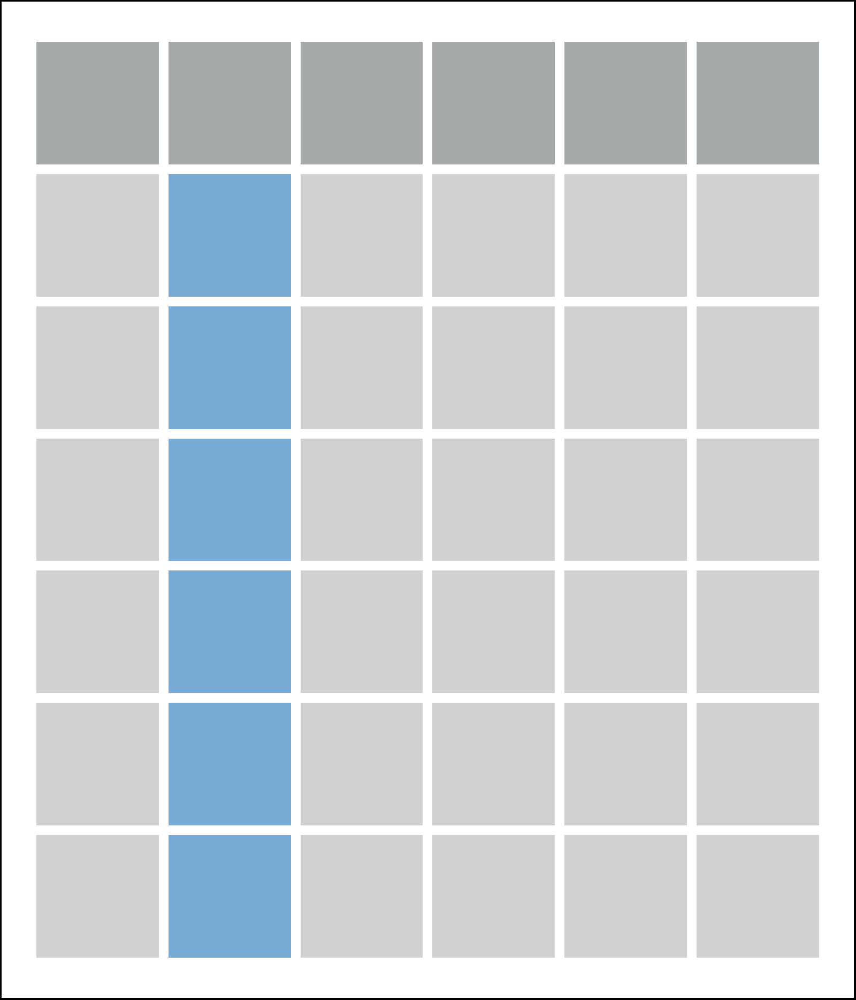
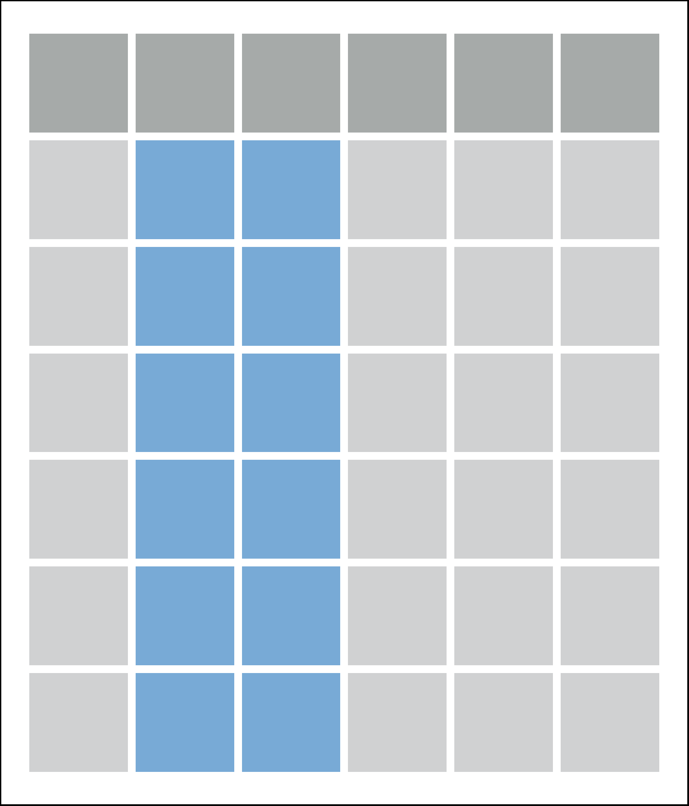
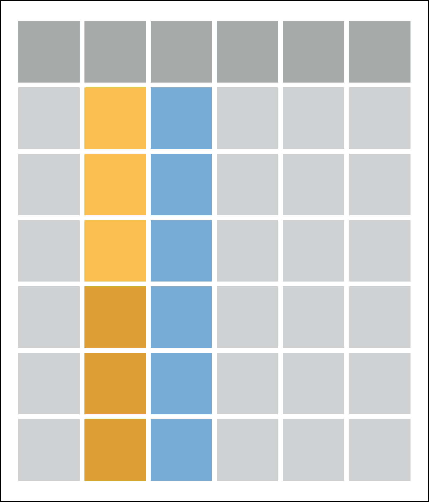
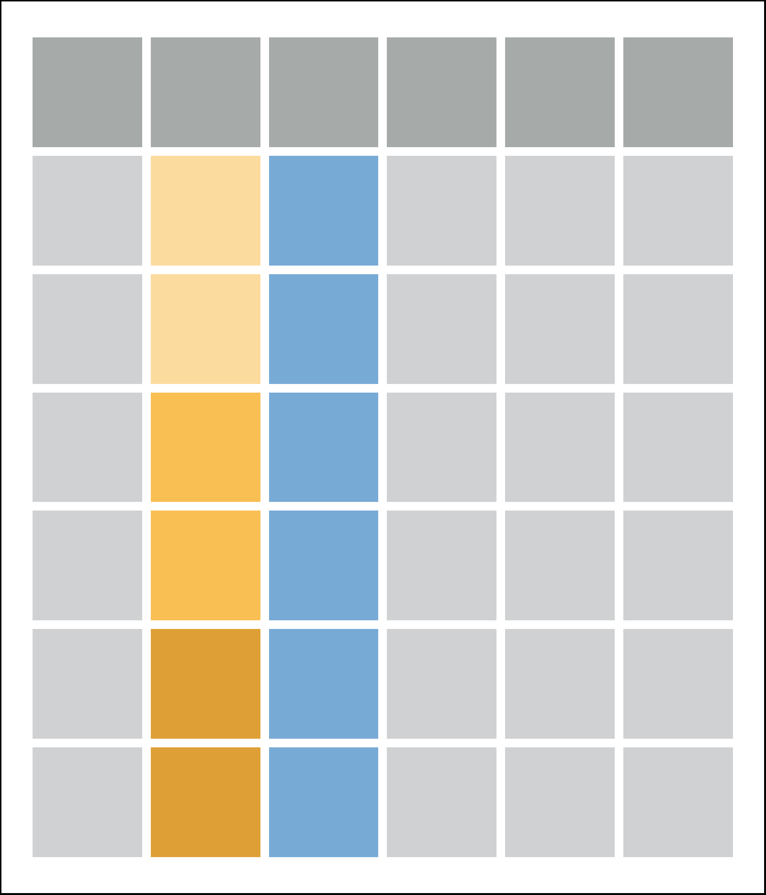

# Hipotézisvizsgálatok {#hipotezisvizsgalatok}

```{r results='asis', echo=FALSE, out.width = '70%'}
knitr::include_graphics(path = "images/ch_10_small.png")
```


```{block2, type='rmdlevel1'}

Ebben a fejezetben a statisztika azon klasszikus próbáit foglaltuk össze, amelyek jellemzően egy- vagy kétmintás hipotézisvizsgálatokat jelentenek. Az öt alfejezet a nullhipotézisben szereplő állításoknak és paramétereknek megfelelően a statisztikai próbák különböző csoportjait fedi le:

* várható értékre vonatkozó próbák
* mediánra vonatkozó nemparaméteres próbák
* valószínűségre vonatkozó próbák 
* varianciára vonatkozó próbák
* az eloszlás egészére vonatkozó próbák. 

```

## Hipotézisvizsgálatok


## Tidyverse R


## Haladó lehetőségek


A fejezetben bemutatott hipotézisvizsgáló függvények közös tulajdonságait három megjegyzésben foglaltuk össze.


* **1. megjegyzés: konfidencia-intervallum kiszámítása a hipotézisvizsgálat során**

A hipotézisvizsgáló függvények outputjában sok esetben konfidencia-intervallum is megjelenik. Ezekben a függvényekben a `conf.level=` argumentum segítségével szabályozhatjuk a megbízhatósági szintet. Alapértelmezés szerint a függvények `conf.level=0.95` argumentummal hívódnak, azaz a 95%-os konfidencia-intervallum határai jelennek meg az outputokban. Az argumentum értékét megváltoztathatjuk, így tetszőleges megbízhatósági szintű intervallumbecslésre van módunk. Mindezt a `t.test()` segítségével mutatjuk be. Ha nem adjuk meg híváskor a `conf.level=` argumentumot, akkor 95%-os lesz az intervallumbecslés megbízhatósága.


```{r}
# a konfidencia-intervallum alapértelmezett (95%-os) megbízhatósággal
x <- c(9, 10, 6, 4, 8, 11, 10, 5, 5, 6, 13, 12)
t.test(x, mu=8)  
```


Ha 99%-os megbízhatóságú konfidencia-intervallumot szeretnénk meghatározni, akkor a `conf.level=0.99` argumentumot kell használni. Figyeljük meg, hogy a `conf.level=` argumentum kizárólag az intervallum határait befolyásolja, más mutatók nem változnak az outputban.

```{r}
# a konfidencia-intervallum 99%-os megbízhatósággal
x <- c(9, 10, 6, 4, 8, 11, 10, 5, 5, 6, 13, 12)
t.test(x, mu=8, conf.level=0.99)  
```


* **2. megjegyzés: kétoldali és egyoldali próbák**

A hipotézisvizsgáló függvények hívása során az `alternative=` argumentummal határozzuk meg, hogy kétoldali vagy egyoldali (bal- vagy jobb-oldali) próbát szeretnénk végrehajtani. Az alapértelmezés a kétoldali próba, amely az `alternative="two.sided"` hívásnak felel meg. Az `alternative=` argumentum lehetséges értéke még a `"less"` és a `"greater"`. 

Összefoglaltuk az `alternative=` argumentum lehetséges értékei és a próbák null- és ellenhipotézisei közötti összefüggést egy- és kétmintás esetben:

* Egymintás próbák
 * `alternative="two.sided"` (kétoldali próba)  
$H_0:\mu=\mu_0$   
$H_1:\mu\neq\mu_0$
 * `alternative="less"` (bal-oldali próba)  
$H_0:\mu=\mu_0$  
$H_1:\mu < \mu_0$
 * `alternative="greater"` (jobb-oldali próba)  
$H_0:\mu=\mu_0$  
$H_1:\mu > \mu_0$

* Kétmintás próbák
 * `alternative="two.sided"` (kétoldali próba)  
$H_0:\mu_1=\mu_2$ (vagy $H_0:\mu_1-\mu_2=0$)    
$H_1:\mu_1\neq\mu_2$ (vagy $H_1:\mu_1-\mu_2 \neq 0$)  
 * `alternative="less"` (bal-oldali próba)  
$H_0:\mu_1=\mu_2$  (vagy $H_0:\mu_1-\mu_2=0$)   
$H_1:\mu_1 < \mu_2$  (vagy $H_1:\mu_1-\mu_2 < 0$)
 * `alternative="greater"` (jobb-oldali próba)  
$H_0:\mu_1=\mu_2$  (vagy $H_0:\mu_1\mu_2=0$)  
$H_1:\mu_1 > \mu_2$  (vagy $H_1:\mu_1-\mu_2 > 0$)


* **3. megjegyzés: a hipotézisvizsgáló függvények visszatérési értéke**

Mielőtt a próbák végrehajtását részletezni kezdjük érdemes még megjegyezni, hogy a hipotézisvizsgáló függvények kétféle módon is használhatók:  

* Az első használati mód szerint a függvényt a megfelelő paraméterekkel meghívjuk és a konzolban megjelenő eredményt értelmezzük. Erre látunk példát fentebb.
* A másik eset azon alapul, hogy a fenti egyszerűbb használaton túlhaladva, közvetlenül is hozzá szeretnénk férni a hipotézisvizsgálat eredményében leolvasható mutatókhoz, vagy azokhoz az adatokhoz, amelyek meg sem jelennek a próba outputjában. Ezek szemléltetésére az egymintás t-próbát megvalósító `t.test()` függvényt hívjuk segítségül, de természetesen bármely másik hipotézisvizsgáló függvényt is választhattuk volna.

Tekintsük az első, egyszerűbb esetet, amikor a próba végrehajtásra mindössze a próba eredményének a képernyőre írását jelenti.

```{r}
# 1. használati mód: a próba eredménye a képernyőre kerül
x <- c(9, 10, 6, 4, 8, 11, 10, 5, 5, 6, 13, 12)
t.test(x, mu=8)  
```


A hipotézisvizsgálat eredménye ugyan a fenti leolvasható, de sokszor van szükségünk a képernyőn megjelenő adatok közvetlen elérésére, vagy azokra az adatokra, amelyeket a hipotézisvizsgáló függvények kiszámolnak, de alapértelmezetten nem jelenítenek meg. A `t.test()` függvény visszatérési értékét ezért most elmentjük egy `h.data` adatobjektumban, amelyet később fel fogunk használni. Az első esetnek megfelelő szokásos megjelenítést a `h.data` adatobjektum nevének parancssorba írásával érhetjük el:

```{r}
# 2. használati mód: t-próba végrehajtása és a visszatérési érték elmentése egy adatobjektumban
x <- c(9, 10, 6, 4, 8, 11, 10, 5, 5, 6, 13, 12)
h.data <- t.test(x, mu=8)  
h.data # a próba eredményének megjelenítése
```


Egyelőre az outputban visszakaptuk a próba eredményét a képernyőn a második használati mód mellett is. A fenti parancsoknak azonban az az előnye, hogy rendelkezésre áll a `h.data` objektum, amely a hipotézisvizsgálat során kiszámolt adatelemeket tárolja. Az adatelemeket felhasználhatjuk a későbbi parancsainkban, például újabb, eddig nem tárolt mérőszámok meghatározásához, vagy ábrák létrehozásához. A példánknál maradva a `t.test()` függvény a hívása során kiszámolja a konfidencia-intervallum határait, amelyet a `h.data` adatobjektum `$conf.int` eleme tartalmaz. Ezt többféle módon is felhasználhatjuk. Egyszerűen a képernyőre írathatjuk az intervallum határait, de az intervallum hosszát is meghatározhatjuk a `diff()` függvény segítségével.

```{r}
# a 95%-os megbízhatóságú konfidencia-intervallum 
h.data$conf.int
```


```{r}
# a 95%-os megbízhatóságú konfidencia-intervallum hossza
diff(h.data$conf.int)
```


A statisztikai próba típusa meghatározza, hogy a `h.data` adatobjektumon belül, milyen adatelemek érhetők el. Ezek eltérhetnek egymástól, hiszen más számítás tartozik például egy t-próbához és más egy khi-négyzet próbához. Ha kíváncsiak vagyunk az elérhető adatelemekre, akkor a `names()` függvénnyel az adatelemek nevét, az `unclass()` függvénnyel a neveken túl az adatelemek értékét is megjeleníthetjük output).

```{r}
names(h.data) # a h.data lista elemeinek neve
unclass(h.data) # a h.data lista elemeinek neve és értéke
```


```{r}
unclass(h.data) # a h.data lista elemeinek neve és értéke
```


A fenti outputokból leolvasható, hogy összesen 9 db adatelem áll rendelkezésre a `h.data` adatobjektumban. Ezek egy része szöveges, és a t-próba megfogalmazásáért felelős (`$method`, `$alternative`, `$data.name`), míg más adatelemek a kiszámolt mutatókat tartalmazzák, például a próbastatisztika értékét (`$statistic`) vagy a p értéket (`$p.value`).

A kétféle használati mód közül az alapján választhatunk, hogy az adott szituációban mire van szükségünk. Ha a próba képernyőn megjelenő eredménye elegendő a feladat megoldásához, akkor az első esetet választjuk. Ha azonban további műveleteket szeretnénk végrehajtani az eredmény egyes elemeivel, akkor tanácsos a második módszer mellett dönteni.

## Próbák választása

Egymintás előjel-próba


## Próbák középértékekre

A statisztika tanulmányozása során elsajátított első próbák intervallum vagy arány skálán mért változókat hasonlítanak össze egymással vagy egy meghatározott értékkel. Ezek közé tartoznak az u-próba és a t-próba különböző változatai. Ebben a fejezetben a `BSDA::z.test()` és a `t.test()` függvényt ismertetjük részletesen. Mindkét függvény használható egymintás, kétmintás és páros mintás esetben is. A `BSDA::z.test()` fügvénnyel az u-próba, míg a `t.test()` függvénnyel a t-próba különböző változatait hajthatjuk végre. A `z.test()` függvényt a `BSDA` és a `TeachingDemos` csomagban is megvalósították, mindkettőről ejtünk szót. 

Adatbázis nélkül is elvégezhetjük a fenti hipotézisvizsgálatokat a `BSDA` csomag `zsum.test()` és `tsum.test()` függvényeinek segítségével. Elegendő a mintaátlag, a mintaelemszám és esetleg a minta szórásának megadása az argumentumokban. Ezen függvények működését is bemutatjuk.

A következő öt alfejezet a várható értékre vonatkozó egy- és kétmintás próbákat tartalmazza:


```{r df_egymintas, fig.align='center', echo=FALSE, include=identical(knitr:::pandoc_to(), 'html'), out.width='20%', fig.link='', fig.cap="RGui alkalmazás a konzollal Windows környezetben"}
knitr::include_graphics('images_df/df_egymintas.png', dpi = NA)
``` 

 


Egymintás próba neve           | R függvény
-------------------------------|-----------------
egymintás u-próba              | `PASWR2::z.test(x, sigma.x, mu)`
egymintás t-próba              | `t.test(x, mu)`
előjel-próba                   | `DescTools::SignTest()`
egymintás Wilcoxon-próba       | `wilcox.test(x, mu)`
Mood-féle medián-próba         | `fisher.test(x, y)` `chisq.test(x, y)`


 


Páros próba neve               | R függvény
-------------------------------|-----------------                               |   
páros u-próba                  | `PASWR2::z.test(x, y, paired=T)`
páros t-próba                  | `t.test(x, y, paired=T)`
páros Wilcoxon-próba           | `wilcox.test(x, y, paired=T)`
páros előjel-próba             | `DescTools::SignTest()`


 


Kétmintás próba neve           | R függvény
-------------------------------|-----------------
kétmintás u-próba              | `PASWR2::z.test(x, y, sigma.x, sigma.y)`
kétmintás t-próba              | `t.test(x, y)` `t.test(formula, data)`
Welch-féle d-próba             | `t.test(x, y, )` `t.test(formula, data)`
Mann--Whitney-féle U-próba     | `wilcox.test(x,y)` `wilcox.test(formula, data)`


 
        
Többmintás, független próba neve          | R függvény
-------------------------------|-----------------
egyszempontos varianciaelemzés | `aov(formula, data)` `lm(formula, data)`
Welch-féle egyszempontos var.  | `oneway.test(formula, data, var.equal=FALSE)`
Kruskal--Wallis-féle H-próba   | `kruskal.test(formula, data)`


Több összetartozó mintás próba neve          | R függvény
-------------------------------|-----------------
egyszempontos összetartozó mintás varianciaelemzés | `aov(formula, data)` `lm(formula, data)`
Friedman-próba                 | `friedman.test(y)` `friedman.test(y, groups, blocks)` `friedman.test(formula, data)`


Ebben a fejezetben a nemparaméteres (eloszlásfüggetlen) próbák végrehajtását mutatjuk be. Az alkalmazhatósági feltétel gyengébb a paraméteres eljárásokhoz képest, többnyire csupán az eloszlás folytonos jellegét tételezik fel. A fejezetben bemutatott próbák:


### 8.1.1. Egymintás u-próba

Egymintás u-próba a gyakorlatban ritkán fordul elő, ugyanis feltételezi a populáció szórásának ismeretét. Azonban sok hipotézisvizsgálatban a próbastatisztika nullhipotézis szerinti eloszlása standard normális eloszlás, így végső soron u-próba végrehajtásához vezet az eljárás. Az egymintás u-próba nullhipotézise: $H_0:\mu=\mu_0$. Az u-próba másik gyakori elnevezése a z-próba.  

Egymintás u-próbát a `TeachingDemos` vagy a `BSDA` csomagban található `z.test()` függvénnyel hajthatunk végre. Az egyértelműség miatt a `z.test()` függvénynév előtt mindig használjuk a `TeachingDemos::` vagy a `BSDA::` minősítőket, hogy elkerüljük a félreértéseket, mivel a két függvény paraméterezése némileg eltér. Az egymintás u-próba általános alakja:

Ha a teljes minta nem ismert, de összesített adatok (mintaátlag és mintaelemszám) rendelkezésre állnak, akkor a `BSDA` csomag `zsum.test()` függvényével is elvégezhetjük a fenti hipotézisvizsgálatot. A `zsum.test()` általános alakja:


Az egymintás u-próba kétoldali ellenhipotézise a $H_1:\mu \neq \mu_0$. A próba végrehajtását bemutatjuk adatbázis használatával és összesített adatok alapján is.

Harminc személy elvégezett egy tesztet, amelynek az eredmény a következő: 9, 10, 6, 4, 8, 11, 10, 5, 5, 6, 13, 12, 4, 4, 3, 9, 12, 5, 6, 6, 8, 9, 8, 5, 7, 9, 10, 9, 5, 4. A tesztről tudjuk, hogy a populációban a tesztátlag 8, a szórás pedig 2. Vizsgáljuk meg 5%-os szignifikanciaszinten, hogy a fenti teszteredmények származhatnak-e ebből a 8 várható értékű populációból.  
Forrás: @Healy, Test 1, I. Example


A adataira egymintás u-próbát hajtunk végre kétoldali ellenhipotézissel: $H_1:\mu \neq 8$. Először a `TeachingDemos`, majd a `BSDA` csomag `z.test()` függvényével végezzük el a tesztet. Mindkét függvényben 3 argumentumot adunk meg: a mintát tartalmazó `x` adatvektort, a nullhipotézisben szereplő $\mu_0$ konstanst (8), és a populáció ismert $\sigma$ szórását (2).


```{r}
# Egymintás u-próba kétoldali ellenhipotézissel a TeachingDemos::z.test() függvénnyel
x <- c( 9,10, 6, 4, 8,11,10, 5, 5, 6,
       13,12, 4, 4, 3, 9,12, 5, 6, 6,
        8, 9, 8, 5, 7, 9,10, 9, 5, 4)
library(TeachingDemos)
TeachingDemos::z.test(x, mu=8, stdev=2)  
```


```{r}
# Egymintás u-próba kétoldali ellenhipotézissel a BSDA::z.test() függvénnyel
x <- c( 9,10, 6, 4, 8,11,10, 5, 5, 6,
       13,12, 4, 4, 3, 9,12, 5, 6, 6,
        8, 9, 8, 5, 7, 9,10, 9, 5, 4)
library(BSDA)
BSDA::z.test(x, mu=8, sigma.x=2)  
```


A `TeachingDemos::z.test()` és a `BSDA::z.test()` függvények nagyon hasonlóan tálalják az eredményeket, így egyszerre tekintjük át őket a  és  output alapján. Az eredmény első tartalmas sora a próba nevét tartalmazza (`"One Sample z-test"`: egymintás u-próba), majd a bemenő adatvektor nevét olvashatjuk (`"data: x"`). A következő sor bővebb információt ad a `TeachingDemos::z.test()` esetében, ezért ezt részletezzük. A `"z = -1.643"` a próbastatisztika konkrét értékét, az `"n = 30.000"` a mintaelemszámot, az `"Std. Dev. = 2.000"` a populáció szórását, az `"Std. Dev. of the sample mean = 0.365"` a standard hibát, és végül a `"p-value = 0.1003"` a p-értéket jelenti. Ezt követi az alternatív hipotézis formája (`"alternative hypothesis: true mean is not equal to 8"`), amely most kétoldali. A következő sorban a konfidencia-intervallum megbízhatósági szintjét (`"95 percent confidence interval:"`), majd az intervallum határait olvashatjuk (`"6.684 8.116"`). Végül a várható értékre vonatkozó pontbecslés tényét és eredményét látjuk (`"7.4"`).

Az összesített adatok ismeretében a `zsum.test()` függvénnyel is megoldható. Ha felsoroljuk az összesített adatokat az argumentumban, akkor a `z.test()` függvény outputjával megegyező eredményt kapunk. A és outputból kiolvasható a mintaátlag, amely a `zsum.test()` első paramétere (`mean.x=7.4`). Ezen kívül a populáció szórását (`sigma.x=2`), a mintaelemszámot (`n.x=30`) és a nullhipotézisben szereplő konstanst kell megadnunk (`mu=8`).


```{r}
# Egymintás u-próba kétoldali ellenhipotézissel összesített adatok alapján
library(BSDA)
zsum.test(mean.x=7.4, sigma.x=2, n.x=30, mu=8)
```


>Az outputból kiolvasható, hogy a próba nem szignifikáns (p-érték = 0.1), így a nullhipotézist megtartjuk, azaz a teszteredmények származhatnak a 8 várható értékű populációból.


A kétoldalú hipotézisvizsgálatra láttunk példát. Most nézzük a két egyoldali esetet.


A `z.test()` és a `zsum.test()` függvénnyel is megoldjuk. A példában $\alpha=0.1$ elsőfajú hiba szerepel, így a szerkesztett konfidencia-intervallum megbízhatósági szintjét 90%-ra állítjuk be. A végrehajtott próba ellenhipotézise bal-oldali: $H_1:\mu < \mu_0$. 

Példa: Atlétacipők átlagos ára
: Kutatók véleménye szerint, az atlétacipők átlagos ára kisebb, mint 80 dollár. Katalógusokből 36 véletlenszerűen kiválasztott cipőre a következő árakat kaptuk (dollárban): 60, 70, 75, 55, 80, 55, 50, 40, 80, 70, 50, 95, 120, 90, 75, 85, 80, 60, 110, 65, 80, 85,  85, 45, 75, 60, 90, 90, 60, 95, 110, 85, 45, 90, 70, 70. Vizsgáljuk meg a kutatók állítását 10%-os szignifikancia szinten! Tegyük fel, hogy a populációban 19.2 dollár a szórás.   
Forrás: 

A fenti példa alapján a bal-oldali ellenhipotézis: $H_1:\mu<80$. Ennek megfelelően a `z.test()` függvényben az `alternative="less"` argumentumot kell megadnunk. A próbák végrehajtása a `TeachingDemos::z.test()` és `BSDA::z.test()` függvényekkel:


```{r}
# Egymintás u-próba bal-oldali ellenhipotézissel
x <- c(60, 70, 75, 55, 80, 55, 50, 40, 80, 70, 50,
95, 120, 90, 75, 85, 80, 60, 110, 65, 80, 85, 
85, 45, 75, 60, 90, 90, 60, 95, 110, 85, 45, 
90, 70, 70)
library(TeachingDemos)
TeachingDemos::z.test(x, mu=80, stdev=19.2, alternative="less", conf.level=0.9)  
library(BSDA)
BSDA::z.test(x, mu=80, sigma.x=19.2, alternative="less", conf.level=0.9)  
```

A fentiekkel megegyező eredményt kapunk, ha a `zsum.test()` függvénnyel oldjuk meg a, de ehhez összesített adatokra van szükség: a mintaátlagra (`mean.x=75`) és a mintaelemszámra (`n.x=36`).

```{r}
# Egymintás u-próba bal-oldali ellenhipotézissel összesített adatok alapján
library(BSDA)
zsum.test(mean.x=75, sigma.x=19.2, n.x=36, mu=80, alternative="less", conf.level=0.9)  
```

>Az próbák eredményéből leolvasható, hogy 10%-os szignifikanciaszint figyelembe vételével szignifikáns eredményt kaptunk, azaz elfogadhatjuk azt az állítást, hogy az atléták cipőjének ára kisebb, mint 80 dollár.

Az  az egyoldali ellenhipotézis egyik formáját, a bal-oldali változatot mutattuk be. Nézzünk példát a jobb-oldali esetre is.


### Egymintás u-próba jobb-oldali ellenhipotézissel

Az egymintás u-próba jobb-oldali ellenhipotézise a $H_1:\mu > \mu_0$. Az eddigieknek megfelelően a bemutatjuk a `z.test()` és a `zsum.test()` függvény használatát is.

Példa. Amerikai nagyvállalatok átlagos árbevétele.
: Kutatók véleménye szerint, a nagy amerikai cégek árbevétele nagyobb, mint 24 milliárd dollár. 50 céget választottak ki egy véletlen mintába, amelyek bevétele milliárd dollárban számolva: 178, 61, 30, 29, 41, 31, 24, 25, 24, 22, 122, 56, 28, 16, 38, 30, 16, 25, 23, 21, 91, 46, 28, 16, 36, 19, 15, 18, 17, 20, 44, 20, 20, 19, 15, 19, 15, 14, 17, 17, 35, 32, 27, 15, 25, 19, 19, 15, 22, 20. Vizsgáljuk meg 5%-os szignifikanciaszinten, hogy ez a vélemény alátámasztható-e. Tegyük fel, hogy a populációbeli szórás 28.7.  
Forrás: 


Az ellenhipotézis jobb-oldali, vagyis $H_1:\mu>24$ alakú. Ebben az esetben a `z.test()` függvényben az `alternative="greater"` argumentumot kell haszálnunk.

```{r}
# Egymintás u-próba jobb-oldali ellenhipotézissel
x <- c(178, 61, 30, 29, 41, 31, 24, 25, 24, 22, 122, 56, 28, 16, 38, 30, 16, 25, 23, 21, 91, 46, 28, 16, 36, 19, 15, 18, 17, 20, 44, 20, 20, 19, 15, 19, 15, 14, 17, 17, 35, 32, 27, 15, 25, 19, 19, 15, 22, 20)
library(TeachingDemos)
TeachingDemos::z.test(x, mu=24, stdev=28.7, alternative="greater")  
library(BSDA)
BSDA::z.test(x, mu=24, sigma.x=28.7, alternative="greater")  
```

A fentiekkel megegyező a `zsum.test()` függvénnyel kapott eredmény is.

```{r}
# Egymintás u-próba jobb-oldali ellenhipotézissel összesített adatok alapján
library(BSDA)
zsum.test(mean.x=31.5, sigma.x=28.7, n.x=50, mu=24, alternative="greater")  
```

>Az outputból kiolvasható, hogy a próba szignifikáns (p-érték = 0.032), a nullhipotézist tehát elutasítjuk. Elegendő bizonyítékot találtunk, hogy azt mondhassuk, a nagy amerikai cégek árbevétele nagyobb 24 milliárd dollárnál.


## Nominális változók elemzése


A nominális változókra vonakozó próbák rendkívül sokszínűek. Vizsgálatuk függ a nominális változók számától, a szintek számától, illetve attól, hogy független vagy összetartozó adatokról beszélünk. Néhány alfejezetben ezekre mutatunk példát:

* hipotézisvizsgálat egy esemény valószínűségére 
* hipotézisvizsgálat két valószínűségre független minták esetén
* hipotézisvizsgálat két valószínűségre párosított minták esetén
* hipotézisvizsgálat kettőnél több valószínűségre független minták esetén
* hipotézisvizsgálat kettőnél több valószínűségre összetartozó minták esetén
* eloszlásvizsgálatok
* függetlenségvizsgálatok

### Hipotézisvizsgálat egy esemény valószínűségére

Egy esemény valószínéségére vonakozó hipotézisvizsgálat felfogható egy nominális változó egy adott értékének előfordulására vonatkozó vizsgálattal. Ez dichotóm esetben a nominális változó eloszlásának vizsgálatát is jelenti egyben. Tesztelhetjük a $H_0:p=0,5$ nullhipotézist, amely kétértékű változó esetén az azonos előfordulási arányt teszteli, vagy az általánosabb $H_0:p=p_0$ nullhipotézist is.

A fenti nullhipotézisek egzakt binomiális próbával, vagy nagyobb minták esetén u-próbával vizsgálhatók. Az R-ben az előbbi a `binom.test()`, az utóbbi a `prop.test()`. A függvények általános alakja:

* `binom.test(x, n, p=0.5, alternative="two.sided", conf.level=0.95)`
* `prop.test(x, n, p, alternative="two.sided", conf.level=0.95, correct=TRUE)`

A fenti függvényekben az `x=` a sikeres esetek számát, az `n=` az összes eset számát, a `p=` a sikeres esetekre vonatkozó hipotetikus populáció valószínűség. Az `alternative=` az alternatív hipotézis alakja, amely alapértelmezés szerint kétoldali, de lehet egyoldalit is választani (`"less"` vagy `"greater"` karakteres konstansok megadásával). A `conf.level=` a szerkesztendő konfidencia intervallum megbízhatósági szintje, amelynek alapértelmezett értéke 0,95. A `correct=` logikai konstans alapértelmezetten a Yates-féle korrekció használatát írja elő a `prop.test()` függvény esetében.


> Egy diák a 20 tételes dolgozatban, amelyben kizárólag igaz-hamis állítások szepeltek, összesen 13 helyes választ ad. Van-e okunk azt hinni, hogy a puszta találgatáson kívül más is szerepet játszott a válaszaiban?


Amennyiben csupán találgatott, akkor egy kérdés helyes megválaszolásának valószínűsége p=0,5, így a $H_0: p=0,5$ lesz a nullhipotézis. A sikeres esetek száma 13, az összes eset 20. Az esemény amire a nullhipotézisban szereplő p vonatkozik, az a *helyes válasz egy tesztkérdésre* esemény.

```{r}
binom.test(x = 13, n = 20, p = 0.5)
```

A fentiek alapján nem tudjuk visszautasítani a $H_0: p=0,5$ (diák csupán találgatott) nullhipotézist a szokásos $\alpha=0,05$ szignifikancia szinten.

> Amennyiben 5 válaszlehetőség közül kell választani egy 20 kérdéses tesztben, akkor hány kérdésre kell helyesen válaszolni, hogy azt mondhassuk, hogy nem találgatással oldotta meg a diák?

```{r}
binom.test(x = 7, n = 20, p = 1/5)$p.value
binom.test(x = 8, n = 20, p = 1/5)$p.value
```

A 7 helyes válasz még a találgatás melletti döntést támogatja, de a 8 vagy annál több helyes döntés már nem.

## Egymintás u-próba

## Egymintás t-próba

## Páros t-próba

## Kétmintás t-próba

## Diszkrét változók vizsgálata

```{r include=FALSE}

# Howel -------------
valasz <- c(123, 157)
res <- chisq.test(valasz, p = c(1/2, 1/2))
res
res$statistic
res$parameter
res$observed
res$expected
res$residuals
res$stdres


valasz <- c(30, 21, 24)
res <- chisq.test(valasz, p = c(1/3, 1/3, 1/3))
res


t <- matrix(data = c(33, 33, 251, 508), ncol = 2)
chisq.test(t, correct = F)

t <- matrix(data = c(13, 14, 36, 30), ncol = 2)
chisq.test(t, correct = F)

library(gplots)
balloonplot(x = as.table(t),  label = FALSE, show.margins = FALSE)
mosaicplot(t)

```


```{r include=FALSE}

# t.test()

# library(userfriendlyscience)
# 
# ourFactor <- factor(mtcars$gear, levels=c(3,4,5),
#                     labels=c("three", "four", "five"));
# ### Add some missing values
# factorWithMissings <- ourFactor;
# factorWithMissings[10] <- factorWithMissings[20] <- NA;
# 
# ### Show frequencies
# freq(ourFactor);
# userfriendlyscience::freq(factorWithMissings)
# 
# 
# library(DescTools)
# Desc(factorWithMissings)
# 
# library(psych)
# DescTools::Freq(factorWithMissings, useNA = "ifany")
# 
# 
# 
# 
# library(jmv)
# jmv::descriptives(data = weather_check, vars = "weather_source", freq = T)
# 
# 
# library(Hmisc)
# 
# library(fivethirtyeight)
# str(weather_check)
# userfriendlyscience::freq(weather_check$weather_source)
# 
# 
# summary(weather_check)
# Hmisc::describe(weather_check)
# 
# 
# #install.packages("datarium")
# library(prettyR)
# prettyR::freq(weather_check$weather_source)
# 
# 
# library(gmodels)
# gmodels::CrossTable(weather_check$ck_weather, weather_check$ck_weather)
# 
# 
# 
# library(descr)
# descr::freq(weather_check$weather_source)
# 
# descr::crosstab(dep = weather_check$weather_source, weather_check$ck_weather, prop.r = T)
# 
# 
# 
# 
# descr::descr(weather_check)
# 
# library(datarium)
# datarium::stress
# 
# 
# library("rstatix")
# rstatix::get_summary_stats(weather_check$ck_weather)
# rstatix::freq_table(weather_check$ck_weather)

```


<!-- #### 8.1.1.4. Kérdések és feladatok az egymintás u-próbára -->


<!-- Tegyük fel, hogy egy bizonyos népességcsoport IQ értéke közelítőleg normális eloszlású 10 szórással. Vizsgáljuk meg a $H_0:\mu=110$ hipotézist 95%-os biztonsági szinten! A mintaelemszám 16, a mintaátlag 113.5.   -->

<!-- Egyes kutatók véleménye szerint az egyetemi adjunktusok fizetése nagyobb 42000 dollárnál. Az átlagfizetés egy 30 elemű minta alapján 43260 dollár. Vizsgáljuk meg 5%-os szignifikanciaszinten azt az állítást, hogy az adjunktusok éves szinten többet keresnek 42000 dollárnál. A populáció szórása 5230 dollár. Oldjuk meg a feladatot a hipotézisvizsgálat mindhárom ismert módszerével: p-érték alapján, elfogadási tartomány alapján és konfidencia-intervallum alapján!   -->
<!-- Forrás:  -->

<!-- Számoljuk ki R-ben a ,  és a  példa megoldásában szereplő R output numerikus értékeit! -->

<!-- Készítsük el a `HH` csomag `normal.and.t.dist()` függvénye alapján a példák hipotézisvizsgálatainak magyarázó ábráját! -->


<!-- 1. Feladatnak: illetve például a `BSDA` csomag `zsum.test()` függvényével hajtható végre -->
<!-- 2. Ez a kérdés nem könnyű, és megköveteli az anyag összeállítását a 3., 4. és 5. fejezetben. Tegyük fel, hogy olyan vezetési tesztet készítünk, amelyről okunk van azt gondolni, hogy az összes sofőr 60% -ának le kell lennie. 30 gépjárművezetőnek adjuk be, 22 pedig átadja. Elegendő-e az eredmény ahhoz, hogy a H0 elutasítását okozzuk (5,60)? Ez a probléma túlságosan nehéz, ahhoz, hogy az X 5 22, 23,. Binomiális anyagának megoldásával megoldható legyen. . . , 30. De tudod, hogy a binomiális közepe és variációja, és valami a formájáról van. Annak a diagramnak a segítségével, hogy hogyan néz ki az eloszlás, képesnek kell lennie a probléma megoldására -->


