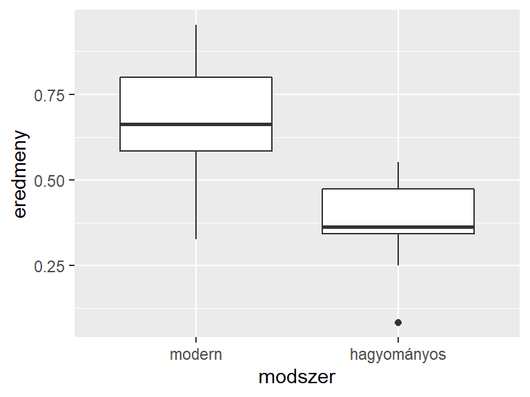
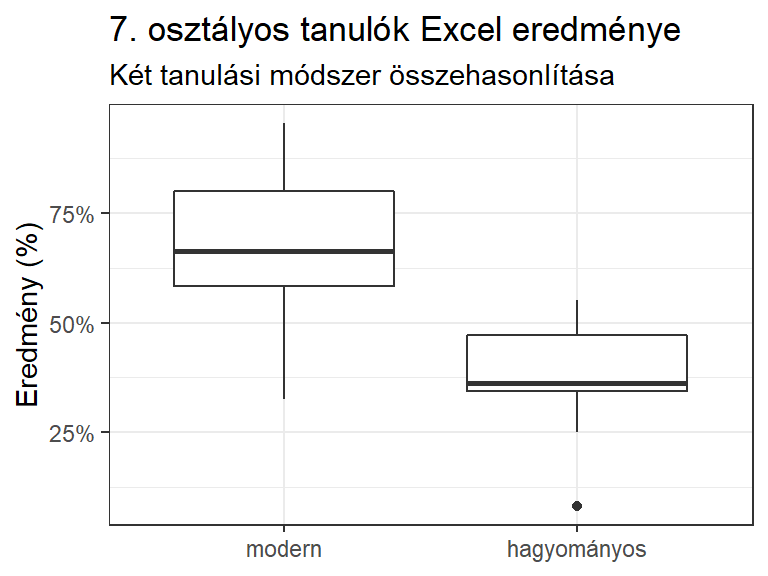

# Itt kezdődik {#itt-kezdodik}


(ref:title-1-1) Elindulás

## (ref:title-1-1) {#Itt-kezdodik-1-szint}

<div class="rmdlevel1">
<p>Ebben a fejezetben:</p>
<ul>
<li>bemutatunk egy konkrét adatelemzési példát,</li>
<li>áttekintjük a könyv tartalmát,</li>
<li>lehetőséget adunk az előzetes R ismeretek felmérésére,</li>
<li>és segítünk a megfelelő fejezet kiválasztására a folytatáshoz.</li>
</ul>
</div>

Könyvünk elsődleges célja az R bemutatása kezdő felhasználók számára, de minden bizonnyal azok is találni fognak hasznos részeket, akik már rendelkeznek R ismeretekkel. Bevezetést nyújtunk az R által lefedett három nagy terület mindegyikébe: az adatkezelésbe, a grafikus megjelenítésbe és az adatelemzésbe is. A leírtak megértéséhez a statisztikai alapismereteken túl semmilyen előzetes tudás nem szükséges.

Most egy konkrét adatelemzési példa segítségével bemutatjuk, hogy mit nyújt e könyv az Olvasó számára. A bevezető példa megoldása során az előismeretekkel rendelkező Olvasó a saját R tudását is felmérheti, és ezzel egyben segítséget kaphat a tudásához és céljaihoz legjobban illeszkedő fejezet kiválasztására, amellyel tovább folytathatja az olvasást.

**Bevezető példa: Két tanítási módszer összehasonlítása**  
Egy 2020-as kutatásunkban [@Csapo2020] 7. osztályos tanulóknak Excel ismereteket oktattunk két különböző megközelítésben. Az egyik csoportban  hagyományos, míg a másikban modern (Sprego) tanítási módszert használtunk. A tanulási időszak az Excel ismeretek felmérésével zárult. Az összegyűjtött adatok az `excel_2020.xlsx` állományban állnak rendelkezésre.   
Nézzük az adatelemzés lépéseit és egyben könyvünk felépítését!

**2. fejezet: Mi az R?**  
A bevezető példa megoldását R-ben fogjuk elvégezni (és nem más eszközben, mint például az SPSS, jamovi, JASP, SAS stb.). Érdemes tehát ismerni az R céljait és lehetőségeit, jó ha van egy összképünk a használt statisztikai programcsomagról. Ezt az áttekintést nyújtja 2 fejezet. 

**3. fejezet: Az R telepítése.**  
Az adatelemzés konkrét lépéseinek elvégzéséhez telepített *Alap R* és *RStudio* szükséges. Ha ezek nem állnak rendelkezésre, vagy még nem is találkoztunk ezekkel az eszközökkel, akkor a 3. fejezet nekünk szól. 

**4. fejezet: Munka az R-ben.**  
Az adatelemzés végrehajtásához az *RStudio*-t ajánljuk, és azon belül pedig a projektek használatát szorgalmazzuk. A 4. fejezetben megismerjük az *RStudio* legalapvetőbb funkcióit, a parancsállományok létrehozását és futtatását.

A fenti előzmények után elkezdhetjük a bevezető példa megoldását:

1. indítsuk el az *RStudio*-t,
1. hozzunk létre egy új projektet,
1. hozzunk létre egy új RMarkdown állományt,
1. helyezzük el a lentebb szereplő R parancsokat az RMarkdown állomány egyes csonkjaiban.

**5. fejezet: Az R nyelv.**  
Az R parancsok létrehozásának vannak szabályai, amelyeket a munka során be kell tartanunk. Ismernünk kell jó néhány függvényt, és általában el kell tudnunk igazodni az R nyelvben. Az 5. fejezet ezért kulcsfontosságú, tanulmányozzuk alaposan, és lehetőleg minden kitűzött feladatát oldjuk meg.

**6. fejezet: Beolvasás**  
Az adatelemzés első lépése az adatállomány beolvasása. Adataink változatos formában állhatnak rendelkezésre, a 6. fejezetben ezek beolvasására kapunk receptet.

A bevezető példa megoldásához az RMarkdown állomány egyik csonkját bővítsük a lenti sorokkal.


```r
# install.packages("rio")                         # rio csomag telepítése
library(rio)                                      # rio csomag betöltése
felmeres <- import(file = "adat/excel_2020.xlsx") # beolvasás
```

**7. fejezet: Adatkezelés**  
A statisztikai elemzés elkezdése előtt számos adatkezelési tevékenységre lehet szükség. Ezt a sokszor rendkívül időigényes folyamatot a 7. fejezetben részletezzük.   

A bevezető példa megoldásához az RMarkdown állomány egyik csonkját bővítsük a lenti sorokkal. Az adatkezelés legtöbbször a beolvasott állomány *jellemzőinek lekérésével* kezdődik.


```r
str(felmeres)              # dataframe szerkezete
names(felmeres)            # változónevek  
unique(felmeres$modszer)   # különböző értékek - osztaly
```

A karakteres vagy numerikus vektorok faktorrá konvertálása az egyik leggyakoribb előkészítő parancs.


```r
felmeres$modszer <- factor(felmeres$modszer)
```

A táblázatok és ábrák megfelelő megjelenéséhez, végezzük el a *faktorszintek sorrendbe állítását*.  


```r
felmeres$modszer <- factor(felmeres$modszer, levels=c("modern", "hagyományos"))
```

**8. fejezet: Mutatók és táblázatok.**  
Ha az adatainkat már megfelelő formába hoztuk, akkor továbbléphetünk az elemzés felé. A 8. fejezet a leíró statisztikai elemzésekből a mutatók és a táblázatok létrehozását mutatja be.

Most a felmérés eredményeinek statisztikai mutatóit íratjuk ki a két tanítási módszert használó csoportban.


```r
# install.packages("psych") # psych csomag telepítése
psych::describeBy(x = felmeres$eredmeny, group = felmeres$modszer, mat=T)
#>     item      group1 vars  n      mean        sd    median   trimmed       mad
#> X11    1      modern    1 13 0.6541958 0.1968892 0.6621212 0.6568871 0.2044191
#> X12    2 hagyományos    1 13 0.3800117 0.1272075 0.3628788 0.3913912 0.1190573
#>            min       max     range       skew  kurtosis         se
#> X11 0.32575758 0.9530303 0.6272727 -0.2885768 -1.189491 0.05460724
#> X12 0.08333333 0.5515152 0.4681818 -0.6434813 -0.114030 0.03528102
```

**9. fejezet: Grafika.**  
A grafikus megjelenítés is a leíró statisztikai elemzés része. A 9. fejezetben részletesebben olvashatunk a publikációkész ábrák létrehozásáról.

Most a numerikus változók esetén használt egyik elterjedt ábrázolási formát, a dobozdiagramot használjuk két tanítási csoport eredményének grafikus összehasonlítására.


```r
library(ggplot2)
ggplot(data = felmeres, mapping = aes(x=modszer, y=eredmeny)) + geom_boxplot()
```



**10. fejezet: Hipotézisvizsgálatok.**  
A statisztikai hipotézisvizsgálat minden adatelemzés központi része, a gyűjtött adatokból a populációra nézve következtetést vonhatunk le.  A 10. fejezetben a leggyakoribb egyváltozós elemzéseket mutatjuk be. 

Most Mann-Whitney-próbát hajtunk végre a két tanítási módszer eredményességének összehasonlítására.


```r
wilcox.test(eredmeny~modszer, data=felmeres)
#> 
#> 	Wilcoxon rank sum exact test
#> 
#> data:  eredmeny by modszer
#> W = 145, p-value = 0.001248
#> alternative hypothesis: true location shift is not equal to 0
```

**11. fejezet: Publikálás.**  
Az adatelemzési folyamat utolsó lépése, az elemzés eredményének publikációkész formába alakítása. A 11. fejezetben megismerjük azokat a legegyszerűbb folyamatokat, amelyekkel többnyire formanyelvtől függetlenül, publikációkész eredményközlést végezhetünk.

Most a bevezető példában kapott eredmények publikálását végezzük el. A korábban használt `psych::describeBy()` függvény hívását úgy módosítjuk, hogy az bármely formanyelven (PDF, HTML, Docx) megfelelő eredményt adjon. Ehhez mindössze egészítsük ki a következő sorokkal a leíró statisztikai elemzést, majd a *Knit* nyomógomb segítségével fordítsuk le az RMarkdown állományt. A leírü statisztikai mutatók máris táblázatos, könnyen áttekinthető formában jelennek meg.


```r
options(OutDec = ",")  # a tizdesjel beállítása
st <- psych::describeBy(x = felmeres$eredmeny, 
                                 group = felmeres$modszer, 
                                 mat=T, digits = 3)
knitr::kable(t(st), align = c("c", "c"))
```

<table>
 <thead>
  <tr>
   <th style="text-align:left;">   </th>
   <th style="text-align:center;"> X11 </th>
   <th style="text-align:center;"> X12 </th>
  </tr>
 </thead>
<tbody>
  <tr>
   <td style="text-align:left;"> item </td>
   <td style="text-align:center;"> 1 </td>
   <td style="text-align:center;"> 2 </td>
  </tr>
  <tr>
   <td style="text-align:left;"> group1 </td>
   <td style="text-align:center;"> modern </td>
   <td style="text-align:center;"> hagyományos </td>
  </tr>
  <tr>
   <td style="text-align:left;"> vars </td>
   <td style="text-align:center;"> 1 </td>
   <td style="text-align:center;"> 1 </td>
  </tr>
  <tr>
   <td style="text-align:left;"> n </td>
   <td style="text-align:center;"> 13 </td>
   <td style="text-align:center;"> 13 </td>
  </tr>
  <tr>
   <td style="text-align:left;"> mean </td>
   <td style="text-align:center;"> 0,654 </td>
   <td style="text-align:center;"> 0,380 </td>
  </tr>
  <tr>
   <td style="text-align:left;"> sd </td>
   <td style="text-align:center;"> 0,197 </td>
   <td style="text-align:center;"> 0,127 </td>
  </tr>
  <tr>
   <td style="text-align:left;"> median </td>
   <td style="text-align:center;"> 0,662 </td>
   <td style="text-align:center;"> 0,363 </td>
  </tr>
  <tr>
   <td style="text-align:left;"> trimmed </td>
   <td style="text-align:center;"> 0,657 </td>
   <td style="text-align:center;"> 0,391 </td>
  </tr>
  <tr>
   <td style="text-align:left;"> mad </td>
   <td style="text-align:center;"> 0,204 </td>
   <td style="text-align:center;"> 0,119 </td>
  </tr>
  <tr>
   <td style="text-align:left;"> min </td>
   <td style="text-align:center;"> 0,326 </td>
   <td style="text-align:center;"> 0,083 </td>
  </tr>
  <tr>
   <td style="text-align:left;"> max </td>
   <td style="text-align:center;"> 0,953 </td>
   <td style="text-align:center;"> 0,552 </td>
  </tr>
  <tr>
   <td style="text-align:left;"> range </td>
   <td style="text-align:center;"> 0,627 </td>
   <td style="text-align:center;"> 0,468 </td>
  </tr>
  <tr>
   <td style="text-align:left;"> skew </td>
   <td style="text-align:center;"> -0,289 </td>
   <td style="text-align:center;"> -0,643 </td>
  </tr>
  <tr>
   <td style="text-align:left;"> kurtosis </td>
   <td style="text-align:center;"> -1,189 </td>
   <td style="text-align:center;"> -0,114 </td>
  </tr>
  <tr>
   <td style="text-align:left;"> se </td>
   <td style="text-align:center;"> 0,055 </td>
   <td style="text-align:center;"> 0,035 </td>
  </tr>
</tbody>
</table>

Publikációnk szerves része a magyarázó ábra. A korábban rajzolt dobozdiagramunkat csinosítsuk ki a következő sorok R csonkba helyezésével. A `ggsave()` függvény a háttértárra rögzítésről is gondoskodik.


```r
library(ggplot2)
p1 <- ggplot(data = felmeres, mapping = aes(x=modszer, y=eredmeny)) + 
  geom_boxplot() + 
  labs(x=NULL, y="Eredmény (%)", 
       title="7. osztályos tanulók Excel eredménye", 
       subtitle = "Két tanulási módszer összehasonlítása") + 
  scale_y_continuous(labels = scales::percent) + theme_bw()
ggsave(filename = "output/kep/dd.png", plot = p1)
p1
```



A bevezető példa megoldásához természetesen a hipotézisvizsgálat szöveges értékelés is hozzátartozik, de ezt most az alfejezet végén szereplő egyik kitűzött feladatra halasztjuk. A hangsúly a könyv vázlatos tartalomjegyzékének bemutatásán volt, részletesebb, de felsorolásszerű tartalomjegyzéket a következő két alfejezetben találunk.

### Összefoglalás {#itt-kezdodik-1-summary}

<div class="rmdsummary">
<p>Ebben az alfejezetben egy adatelemzési példát oldottunk meg, melynek segítségével illusztrálni tudtuk a további fejezetek tartalmát. A 2. fejezetben áttekintést adunk az R-ről, a 3.-ban az <em>Alap R</em> és <em>RStudio</em> telepítését, a 4.-ben az <em>RStudio</em> használatát mutatjuk be. Az 5. fejezetben kellő részletességgel ismertetjük az R nyelvet. A további fejezetekben az adatelemzés szokásos lépéseit vesszük sorra, a 6. fejezetben a beolvasást, a 7. fejezetben az adatok előkészítését, a 8. és 9. fejezetben a leíró statisztikai műveleteket mutatjuk be. A 10. fejezet az egyváltozós hipotézisvizsgálatoké, az utolsó, 11. fejezet az eredmények publikálását foglalja össze.</p>
</div>

### Feladatok  {#itt-kezdodik-1-exercise}

<div class="rmdexercise">
<ol style="list-style-type: decimal">
<li>Milyen online vagy nyomtat könyvek segítik az R elsajátítását? Próbáljuk összegyűjteni a magyar nyelvű könyveket is!</li>
<li>Térképezzük fel az online videókurzusokat is az R tanulásához!</li>
<li>A bevezető példa (<em>Két tanítási módszer összehasonlítása</em>) megoldásában a hipotézisvizsgálat alapján adjunk szöveges értékelést!</li>
</ol>
</div>

[A fenti feladatok megoldása](#itt-kezdodik-1-exercise-solution)


## A könyv felépítése


<div class="rmdlevel2">
<p>Ebben a fejezetben:</p>
<ul>
<li>bemutatjuk a könyv részletes felépítését,</li>
<li>ezzel tovább segítjük a választást a folytatáshoz.</li>
</ul>
</div>

A könyv 11 fejezetből áll, és fejezetenként 3 vagy több alfejezetből. Most röviden bemutatjuk az egyes alfejezetek tartalmát. 


+-------------------------------------------+-----------------------------------------------------------------------------------+
| Fejezet/alfejezet                         | Leírás                                                                            |
+===========================================+===================================================================================+
| **1. Itt kezdődik**                       |                                                                                   |
+-------------------------------------------+-----------------------------------------------------------------------------------+
| 1.1. Elindulás                            | A könyv fejezeteinek bemutatása egy konkrét adatelemzésen keresztül               |
+-------------------------------------------+-----------------------------------------------------------------------------------+
| 1.2. A könyv felépítése                   | A könyv egyes alfejezeteinek rövid bemutatása (jelen alfejezet)                   |
+-------------------------------------------+-----------------------------------------------------------------------------------+
| 1.3. Próbák listája                       | A könyvben szereplő egyváltozós statisztikai eljárások listája                    |
+-------------------------------------------+-----------------------------------------------------------------------------------+
|                                           |                                                                                   |
+-------------------------------------------+-----------------------------------------------------------------------------------+
| **2. Mi az R?**                           |                                                                                   |
+-------------------------------------------+-----------------------------------------------------------------------------------+
| 2.1. Az R bemutatása                      | A parancssoros R jellemzői, az R nyelv, az *Alap R* és a csomag fogalma           |
+-------------------------------------------+-----------------------------------------------------------------------------------+
| 2.2. A modern R                           | Megtanuljuk a *Tidyverse R* fogalmát, megtudjuk mi a modern R                     |
+-------------------------------------------+-----------------------------------------------------------------------------------+
| 2.3. Múlt és jelen                        | Az R rövid története, alapelvek az R tanulásához, és az R alaptudás elemei        |
+-------------------------------------------+-----------------------------------------------------------------------------------+
|                                           |                                                                                   |
+-------------------------------------------+-----------------------------------------------------------------------------------+
| **3. Az R telepítése**                    |                                                                                   |
+-------------------------------------------+-----------------------------------------------------------------------------------+
| 3.1. Az Alap R és az RStudio telepítése   | Megismerjük az *Alap R* és az *RStudio* telepítését                               |
+-------------------------------------------+-----------------------------------------------------------------------------------+
| 3.2. A Tidyverse R telepítése             | A **tidyverse** csomag(gyűjtemény) telepítése                                     |
+-------------------------------------------+-----------------------------------------------------------------------------------+
| 3.3. Az R frissítése                      | Az *Alap R*, az *RStudio* és a csomagok frissítésének módszerei                   |
+-------------------------------------------+-----------------------------------------------------------------------------------+
|                                           |                                                                                   |
+-------------------------------------------+-----------------------------------------------------------------------------------+
| **4. Munka az R-ben**                     |                                                                                   |
+-------------------------------------------+-----------------------------------------------------------------------------------+
| 4.1. Az RStudio használata                | Az *RStudio* jellemzői és felépítése, a projektek használata és a segítségkérés   |
+-------------------------------------------+-----------------------------------------------------------------------------------+
| 4.2. Segítség az R használatához          | Segítségkérési lehetőségek az R-ben, a beépített súgó használata                  |
+-------------------------------------------+-----------------------------------------------------------------------------------+
| 4.3. Az Alap R használata                 | Az *Alap R* konzola, az *RGui*, az *R Commander* és a kötegelt üzemmód lehetőségei|
+-------------------------------------------+-----------------------------------------------------------------------------------+
|                                           |                                                                                   |
+-------------------------------------------+-----------------------------------------------------------------------------------+
| **5. Az R nyelv**                         |                                                                                   |
+-------------------------------------------+-----------------------------------------------------------------------------------+
|                                           |                                                                                   |
+-------------------------------------------+-----------------------------------------------------------------------------------+
| **6. Beolvasás**                          |                                                                                   |
+-------------------------------------------+-----------------------------------------------------------------------------------+
|                                           |                                                                                   |
+-------------------------------------------+-----------------------------------------------------------------------------------+
| **7. Adatmanipuláció**                    |                                                                                   |
+-------------------------------------------+-----------------------------------------------------------------------------------+
|                                           |                                                                                   |
+-------------------------------------------+-----------------------------------------------------------------------------------+
| **8. Mutatók és táblázatok**              |                                                                                   |
+-------------------------------------------+-----------------------------------------------------------------------------------+
|                                           |                                                                                   |
+-------------------------------------------+-----------------------------------------------------------------------------------+
| **9. Grafika**                            |                                                                                   |
+-------------------------------------------+-----------------------------------------------------------------------------------+
|                                           |                                                                                   |
+-------------------------------------------+-----------------------------------------------------------------------------------+
| **10. Hipotézisvizsgálatok**              |                                                                                   |
+-------------------------------------------+-----------------------------------------------------------------------------------+
|                                           |                                                                                   |
+-------------------------------------------+-----------------------------------------------------------------------------------+
| **11. Publikáció**                        |                                                                                   |
+-------------------------------------------+-----------------------------------------------------------------------------------+


### Összefoglalás {#itt-kezdodik-2-summary}

<div class="rmdsummary">
<p>Ebben a részben röviden bemutattuk a könyv összes alfejezetét. A későbbiekben térképként használhatja az Olvasó az itt ismertetett táblázatot.</p>
</div>


### Feladatok  {#itt-kezdodik-2-exercise}

\BeginKnitrBlock{rmdexercise}<div class="rmdexercise">
1. Az adatfeldolgozás 4 lépése a következő: (1) adatok beolvasása, (2) adatok előkészítése elemzésre, (3) adatok elemzése és (4) az eredmények publikálása. A könyv mely fejezetei tartoznak az adatfeldolgozás fenti lépéseihez?
1. Az R-rel való munka általunk javasolt módja: *RStudio*-ban, projektmódban, R vagy RMarkdown állományokat szerkesztünk és hajtunk végre. Mely fejezetekben találunk hasznos információkat az R ezen használatával kapcsolatban?

</div>\EndKnitrBlock{rmdexercise}


## Próbák listája

<div class="rmdlevel3">
<p>Ebben a fejezetben:</p>
<ul>
<li>áttekintést adunk az egy- és kétváltozós hipotézisvizsgálatokról.</li>
</ul>
</div>


A 10. fejezetben bemutatjuk az egy- és kétváltozós hipotézisvizsgálatok végrehajtását. Ebben a fejezetben felsoroljuk a legfontosabb próbákat, összesen öt táblázatban soroljuk fel őket:

* egy mintát vizsgáló próbák (\@ref(tab:egyminta1) táblázat),
* páros mintát vizsgáló próbák (\@ref(tab:parosminta1) táblázat),
* két független mintát vizsgáló próbák (\@ref(tab:ketminta1) táblázat),
* több összetartozó mintát vizsgáló próbák (\@ref(tab:tobbosszeminta1) táblázat),
* több független mintát vizsgáló próbák (\@ref(tab:tobbminta1) táblázat).

A táblázatokban megadjuk, hogy a vizsgálatnak mi a célja, vagyis a populációbeli változó(k) melyik paraméterére vonatkoznak a próbák, a várható értékre, a mediánra, a varianciára vagy a valószínűségre. A 10. fejezetben foglalkozunk az eloszlásvizsgálatok közül a normalitást ellenőrző próbákkal is, így a \@ref(tab:egyminta1) táblázat ezeket is számba veszi.


Table: (\#tab:egyminta1) Egy minta vizsgálata


+------------------+-------------------------------------------+---------------------------+
| Cél              | Próba neve                                | R függvény                |
+==================+===========================================+===========================+
| várható érték    | egymintás u-próba                         | `BSDA::z.test()`          |
+------------------+-------------------------------------------+---------------------------+
|                  | egymintás t-próba                         | `t.test()`                |
+------------------+-------------------------------------------+---------------------------+
| medián           | előjel-próba                              | `BSDA::SIGN.test()`       |
+------------------+-------------------------------------------+---------------------------+
|                  | Mood-féle medián-próba                    |                           |
+------------------+-------------------------------------------+---------------------------+
|                  | egymintás Wilcoxon-próba                  | `wilcox.test()`           |
+------------------+-------------------------------------------+---------------------------+
| variancia        | khí-négyzet próba                         | `chisq.test()`            |
+------------------+-------------------------------------------+---------------------------+
| valószínűség     | khí-négyzet próba                         | `chisq.test()`            |
+------------------+-------------------------------------------+---------------------------+
| normalitás       | Shapiro-Wilk próba                        | `shapiro.test()`          |
+------------------+-------------------------------------------+---------------------------+
|                  | Kolmogorov-Szmirnov próba                 | `DescTools:LillieTest()`  |
+------------------+-------------------------------------------+---------------------------+
      

Table: (\#tab:parosminta1) Páros minta vizsgálata


+------------------+-------------------------------------------+---------------------------+
| Cél              | Próba neve                                | R függvény                |
+==================+===========================================+===========================+
| várható érték    | páros t-próba                             | `t.test(paired=T)`        |
+------------------+-------------------------------------------+---------------------------+
| medián           | páros előjel-próba                        | `BSDA::SIGN.test()`       |
+------------------+-------------------------------------------+---------------------------+
|                  | páros Wilcoxon-próba                      | `wilcox.test(paired=T)`   |
+------------------+-------------------------------------------+---------------------------+
| variancia        |                                           | `var.test()`              |
+------------------+-------------------------------------------+---------------------------+
| valószínűség     | McNemar-próba                             | `mcnemar.test()`          |
+------------------+-------------------------------------------+---------------------------+
|                  | Cohran-Q próba                            | `mcnemar.test()`          |
+------------------+-------------------------------------------+---------------------------+


Table: (\#tab:ketminta1) Két független minta vizsgálata


+------------------+-------------------------------------------+---------------------------+
| Cél              | Próba neve                                | R függvény                |
+==================+===========================================+===========================+
| várható érték    | kétmintás u-próba                         | `BSDA::z.test()`          |
+------------------+-------------------------------------------+---------------------------+
|                  | kétmintás t-próba                         | `t.test()`                |
+------------------+-------------------------------------------+---------------------------+
|                  | Welch-féle d-próba                        | `t.test(var.equal=F)`     |
+------------------+-------------------------------------------+---------------------------+
| medián           | Mann--Whitney-próba                       | `wilcox.test()`           |
+------------------+-------------------------------------------+---------------------------+
| variancia        | F-próba                                   | `var.test()`              |
+------------------+-------------------------------------------+---------------------------+
| valószínűség     | khí-négyzet próba                         | `chisq.test()`            |
+------------------+-------------------------------------------+---------------------------+
|                  | Fisher-féle egzakt próba                  | `fisher.test()`           |
+------------------+-------------------------------------------+---------------------------+


Table: (\#tab:tobbosszeminta1) Több összetartozó minta vizsgálata


+------------------+-----------------------------+--------------------+
| Cél              | Próba neve                  | R függvény         |
+==================+=============================+====================+
| várható érték    | egyszempontos összetartozó\ | `ez::ezANOVA()`    |
|                  | mintás varianciaelemzés     |                    |
+------------------+-----------------------------+--------------------+
| medián           | Friedman-próba              | `friedman.test()`  |
+------------------+-----------------------------+--------------------+


Table: (\#tab:tobbminta1) Több független minta vizsgálata

+------------------+-------------------------------------------+---------------------------+
| Cél              | Próba neve                                | R függvény                |
+==================+===========================================+===========================+
| várható érték    | egyszempontos varianciaelemzés            | `aov()`                   |
+------------------+-------------------------------------------+---------------------------+
|                  | Welch-féle egyszempontos varianciaelemzés | `oneway.test(var.equal=F)`|
+------------------+-------------------------------------------+---------------------------+
| medián           | Kruskal--Wallis-próba                     | `kruskal.test()`          |
+------------------+-------------------------------------------+---------------------------+
| variancia        | Levene-próba                              | `DescTools::LeveneTest()` |
+------------------+-------------------------------------------+---------------------------+
|                  | Bartlett-próba                            | `bartlett.test()`         |
+------------------+-------------------------------------------+---------------------------+


### Összefoglalás {#itt-kezdodik-3-summary}

<div class="rmdsummary">
<p>Ebben a részben rövid áttekintést adtunk a könyv 10. fejezetében sorra kerülő statisztikai próbákról. Megneveztük a próbákat, R parancsokkal szemléltettük használatukat, valamint jeleztük a céljukat. A táblázatok áttekintésével képet kaphatunk arról, hogy a későbbiekben milyen jellegű statisztikai következtetéseket tudunk levonni az R használatával.</p>
</div>


### Feladatok  {#itt-kezdodik-3-exercise}


\BeginKnitrBlock{rmdexercise}<div class="rmdexercise">  
1. Minden statisztikai próba esetében négy dolgot érdemes tudni: (1) a statisztikai próba neve, (2) null- és ellenhipotézise, (3) alkalmazási feltételei, és (4) a próba végrehajtásának módja valamely statisztikai programcsomagban. A 10. fejezetben a statisztikai próbák végrehajtását természetesen R-beli eszközökkel mutatjuk be. Ismerjük a fenti táblázatokban megnevezett próbák null- és ellenhipotézisét, valamint az alkalmazási feltételeit? Próbáljuk ezeket felidézni! Hol találunk ezekről információt?
1. Mely próbák maradtak ki ebből a könyvből? Hol találunk ezek R-beli végrehajtására példát? 
  </div>\EndKnitrBlock{rmdexercise}


