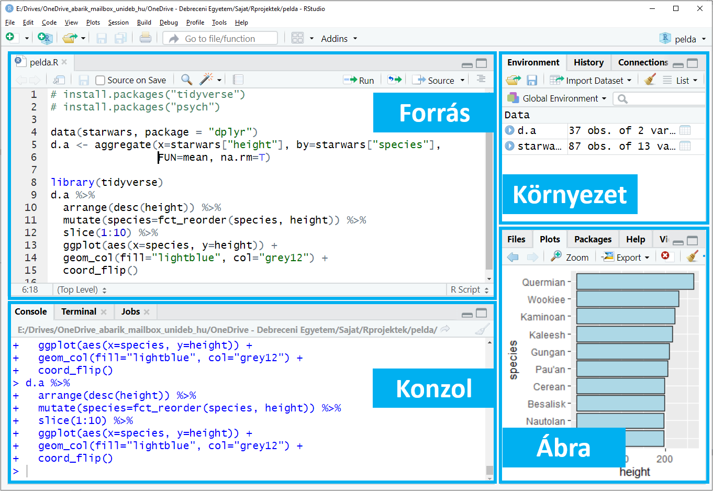
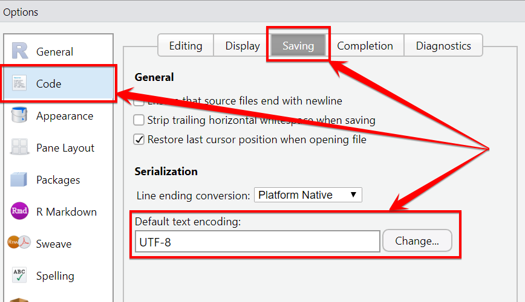
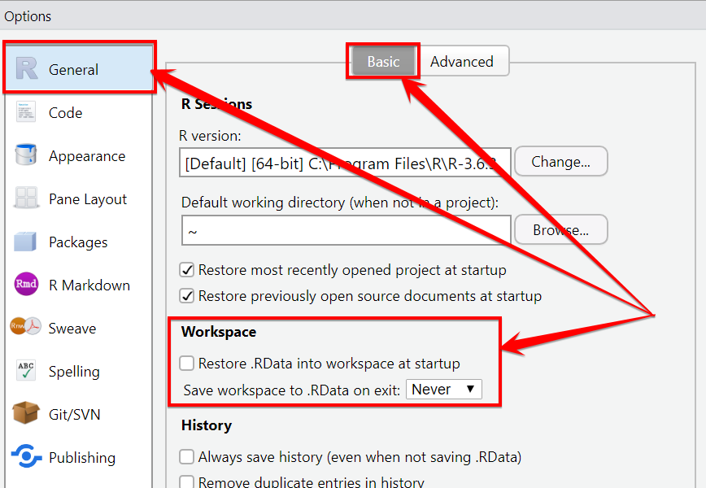
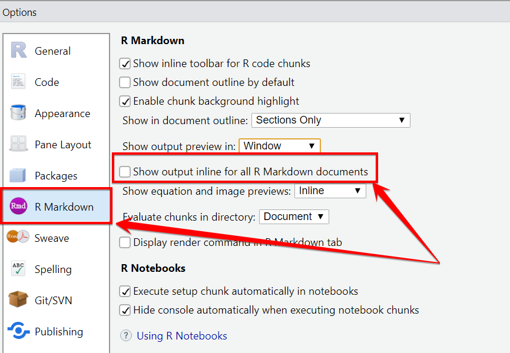
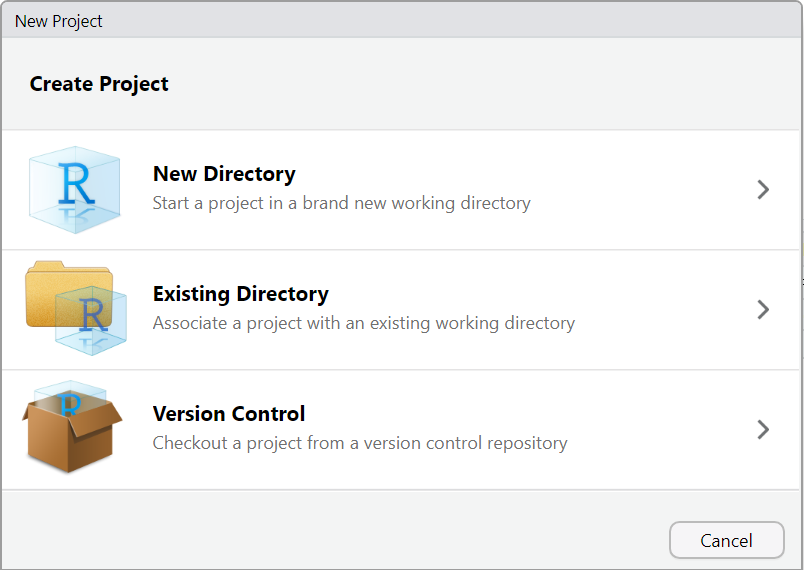
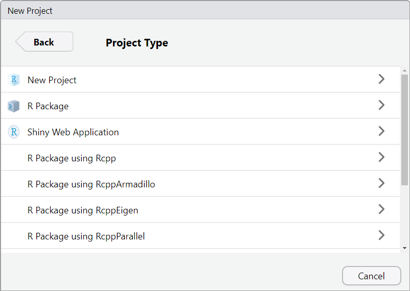
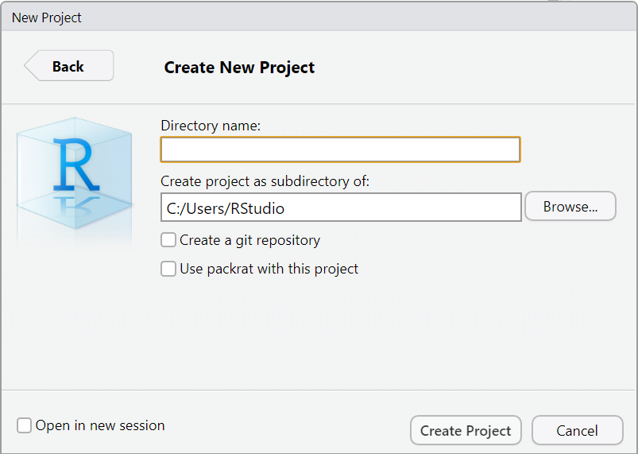
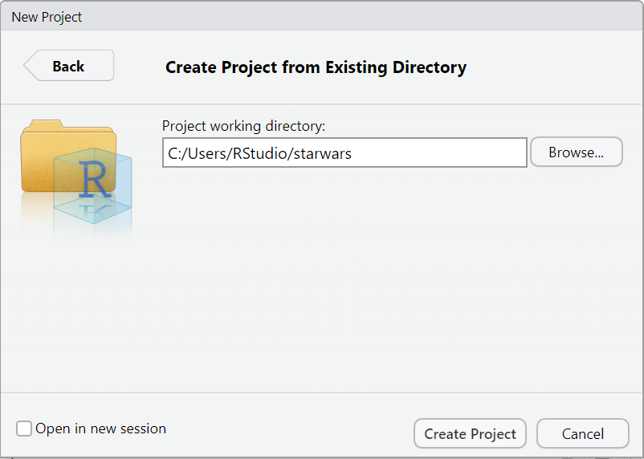
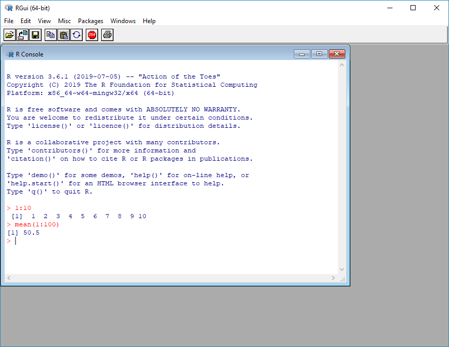
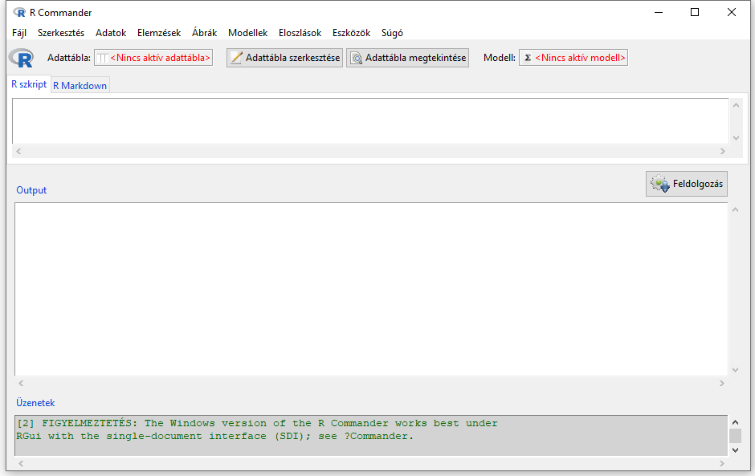

# Munka az R-ben {#munka-az-r-ben}


## Az RStudio használata {#AzRStudiohasznalata}

<div class="rmdlevel1">
<p>Ebben a fejezetben:</p>
<ul>
<li>megismerjük az <em>RStudio</em> jellemzőit és felépítését,</li>
<li>a konzolos és parancsállományos használat különbségeit,</li>
<li>a parancsállományok és az RMarkdown állományok lehetőségeit,</li>
<li>a projekt fogalmát és használatát,</li>
<li>és az <em>RStudio</em> billenytűparancsait.</li>
</ul>
</div>

Miután minden szükséges szoftverkomponenst feltelepítettünk, hogyan tudjuk működésre bírni az R-t? Tegyük fel, hogy van egy nagyon egyszerű adatfeldolgozási problémánk, szeretnénk megtudni a Csillagok háborúja c. film karaktereinek átlagos testmagasságát. Ha rátalálunk egy alkalmas adatbázisra, amely tartalmazza a szereplők testmagasságait, akkor még két konkrét adatelemzési lépés vár ránk: (1) az adatbázis megnyitása, (2) az átlagos testmagasság meghatározása. Korábban láttuk, hogy az R parancssoros, tehát a fenti két lépést R parancsok formájában kell megfogalmaznunk. Kérdés, hová írjuk a parancsainkat, hogyan hajthatjuk őket végre, és végül, milyen parancsokkal érhetjük el a célunkat. Ebben a fejeztben az első két kérdésre fókuszálunk, hová írhatjuk a parancsainkat és hogyan tudjuk azokat hatékonyan végrehajtani. 

Máris megválaszoljuk a kérdéseket. Korábban láttuk, hogy az *Alap R* telepítésével elérhetővé válik a *konzol*, ahová parancsainkat begépelve, majd `ENTER`-t ütve utasításokat tudunk végrehajtani. Az *RStudio* telepítésével is kapunk egy konzolt, amelynek működése megegyezik az *Alap R* konzoljával: ide is gépelhetünk parancsokat, és `ENTER`-rel végrehajthatjuk őket. A konzol azonban nem a legkényelmesebb módja az R parancsok végrehajtására. Érdemes szöveges állományba gyűjteni az adatfeldolgozáshoz kapcsolódó R parancsainkat, és azokat egyesével, többet egyszere, vagy akár az összeset elküldeni a konzolba végrehjatásra. Ezeknek a szöveges állományoknak két fajtáját ismerjük meg ebben a könyvben: a parancsállományokat és az RMarkdown állományokat (a 11. fejezetben az RMarkdown állományokról többet olvashatunk). A parancsállományok és az RMarkdown állományok létrehozásához is a legtöbb segítséget az *RStudio* nyújtja: a parancsok begépelését drámaian leegyszerűsíti, és egyben számos más kényelmi funkciót is ajánl. Hová írjuk tehát az R parancsainkat? Az *RStudio* parancsállományaiba vagy RMarkdown állományaiba. Kezdjük a fejezetet az *RStudio* lehetőségeinek megismerésével! 

### Az RStudio jellemzői

Fontos tisztázni, az *RStudio* használatához feltétlenül szükség van a telepített *Alap R*-re, nélküle nem tudunk R parancsokat futtatni. Jó gyakorlat, ha az *RStudio* telepítése előtt telepítjük fel az *Alap R*-t, de a fordított sorrend sem okoz problémát. Sőt, ha az *Alap R* egy új verzióját telepítjük fel, akkor a korábban telepített *RStudio* már az új verziójú R futtató környezetét fogja használni. Az *RStudio* tudása tehát a végrehajtható R parancsok tekintetében megegyezik az *Alap R* tudásával, hiszen minden utasítás, amelynek a végrehajtását az *RStudio*-ban kezdeményezzük, végső soron az *Alap R*-rel telepített interpreterhez kerül, és a végrehajtásáért ő felel. Az *RStudio* elsősorban a parancsok írását könnyíti meg, segítségével a parancsok létrehozásához kapunk rendkívüli segítséget. 

Megjegyezzük, hogy az *RStudio* egy üzleti vállalkozás neve is egyben, amely többféle terméket fejleszt. Ezek egyike az *RStudio*-nak nevezett integrált fejlesztőkörnyezet, kimondottan az R programozási nyelv számára. Foglaljuk össze, hogy melyek az *RStudio* erősségei.

* **Parancsok írásának könnyítése.** Az R parancsok begépelését számos eszköz segíti, például a kódkiegészítés, a szintaxisnak megfelelő kódszínezés és a tippek megjelenítése.
* **Integrált környezetben, egy felületen látjuk a munka során szükséges összes komponenst.** Az adatelemzési munka nem merül ki a parancsok begépelésében és végrehajtásában. Az R parancsokat jelentő forráskódon kívül kezelnünk kell az outputot, ami lehet szöveges és ábra jellegű is, valamint el kell igazodnunk a memóriában tárolt adatok között is. Sokszor a súgót is meg kell jelenítenünk, és információval kell rendelkeznünk a telepített csomagokról is. Az *RStudio* nagy előnye, hogy mindezt egyetlen integrált felületen láthatjuk és ezen keresztül vezérelhetjük.
* **Projektek használata.** Az *RStudio* támogatja a projektek használatát is, amellyel az adott adatfeldolgozási folyamat összetevőit -- az adatállományokat, parancsállományokat, RMarkdown állományokat, képállományokat és dokumentációkat --, egyetlen könyvtárba foghatjuk össze, és a forráskódból relatívan hivatkozhatunk ezekre az állományokra.
* **Publikálás támogatása.** Az RMarkdown segítségével kényelmesen és reprodukálható módon hozhatunk létre például PDF, HTML és Word formanyelvű dokumentumokat, vagy PDF, HTML és PowerPoint bemutatókat. 
* **További lehetőségek.** Az *RStudio* támogatja a Shiny Webes alkalmazások fejlesztését, de saját csomagok létrehozásához is kapunk segítséget. Az *RStudio* támogatja a Git verziókezelő használatát is.

Az *RStudio* fenti lehetőségeinek bemutatása külön könyvet igényelne, de a mindennapi munkához szükséges ismereteket most bemutatjuk. 

### Az RStudio felépítése

Az *RStudio* indítása után egy több panelból álló alkalmazást látunk. Első indításnál három részre van osztva az alkalmazás, vagyis három panel látható, de a tipikus használat során négy panelünk van. Válasszuk ki először a `File / New file / New R Script` menüpontot, amely egy új parancsállomány létrehozását kezdeményezi. E lépés után már biztosan a négy-paneles, \@ref(fig:rstudio-01) ábrán látható elrendezést kapjuk. Az ábran megneveztük az egyes részeket, a két bal oldali panel a *Forrás* és a *Konzol*, a jobb oldaliak a *Környezet* és az *Ábra*. Figyeljük meg, hogy a panelek tetején fülek láthatók, így az egyes paneleken különböző lapokat tudunk kiválasztanai, egy panel tehát több lapot is tartalmazhat. A panelek szélessége és magassága állítható, egyrészt az elválasztó sávokat az egér segítségével mozgathatjuk, másrészt a panelek méretező gombjain (az egyes panelek jobb felső sarkában) is kattinthatunk. A méretezés során eltűnhetnek panelek, de a sávok mozgatásával vagy a `View / Panes / Show All Panes` menüponttal láthatóvá tehetjük az összes panelt.


<div class="figure" style="text-align: center">
<a href="" target="_blank"></a>
<p class="caption">(\#fig:rstudio-01)Az RStudio tipikus képernyőképe</p>
</div>


A legtöbb időt a *Forrás* nevű bal felső panelben töltjük, mert alapértelmezetten itt jelennek meg a parancsállományok és az RMarkdown állományok lapjai. Az R parancsainkat tehát ide írjuk. Az *RStudio* első indításánál ez a panel üres, de a további indításoknál a korábban szerkesztett, de be nem zárt lapok automatikusan megnyílnak. Itt helyeztünk el korábban egy parancsállomány lapot a `File / New file / New R Script` segítségével. Ez a lap egy egyszerű szövegszerkesztő. Győződjünk meg erről, próbáljuk ki, mert a jövőben ebben a szövegszerkesztőben töltjük a legtöbb időt! A fejezet végi kitűzött feladatok között rákérdezünk a szövegszerkesztési ismeretekre. Oldjuk meg most azt a feladatot, majd térjünk vissza ide!

A bal alsó panel a *Konzol* nevet viseli, vagyis ez az *RStudio* konzolja, melynek használata és célja megegyezik az *Alap R* konzoljával. Vagyis begépelhetünk parancsokat, és az `ENTER`-rel végrehajtjuk őket. Azonban a konzol mindössze egysoros szövegszerkesztési lehetőséget kínál, lényegében egyszerre egy parancs begépelésére és végrehajtására van lehetőségünk. Ez lényegesen eltér a *Forrás* panel parancsállomány vagy RMarkdown lapján lévő teljes értékű szövegszerkesztőtől, ahol több sor begépelésére és végrehajtására van lehetőségünk. A konzol azonban mégis központi szerepet kap, mert alapesetben az R csak a konzolba kerülő parancsokat tudja végrehajtani. A parancsállományok és RMarkdown állományok R parancsait is valahogyan át kell ide irányítani, úgy mintha ide gépeltük volna be őket. De a konzol nem csak a parancsainkat, azaz az inputot, hanem azok eredményét, az outputot is tartalmazza.  

A két jobb oldali panel többfunkciós. A jobb felső, *Környezet* panelben jelennek meg a munka során létrehozott objektumok nevei (*Environment* lap), valamint a parancsok története (*History* lap). Az *Environment* lapon megjelenő adatbázis nevén kattintva a *Forrás* panelben egy külön lapon megjelenik az adatbázis tartalma, így kapjuk az ún. adatbázis lapot. A jobb alsó *Ábra* panel tartalmazza a súgót (*Help* lap), a munka során rajzolt ábráinkat (*Plot* lap), a csomagjaink listáját (*Packages* lap) és a munkakönyvtárunk állományait, könyvtárait (*Files* lap). A két jobb oldali panel elnevezés önkényes volt, hiszen az *Environment* és a *Plot* csak egy-egy lap neve ezeken a többfunkciós paneleken. 

### Az RStudio beállításai 

Mielőtt elkezdjük a munkát az *RStudio*-ban feltétlenül végezzünk el néhány beállítást. Az *RStudio* működését az `Tools / Global Options` menüpont alatt módosíthatjuk.

**UTF-8 kódolás beállítása.** A fenti menüpont kiválasztása után a bal oldali listából a `Code`, majd a fenti opciók közül a `Saving` opciót válasszuk. A \@ref(fig:rstudio-utf8) ábrán is látható módon, érjük el, hogy a `Default text encoding` alatt az `UTF-8` legyen kiválasztva. Fontos, hogy minden szöveges állományunk UTF-8 kódolású legyen. 

<div class="figure" style="text-align: center">
<a href="" target="_blank"></a>
<p class="caption">(\#fig:rstudio-utf8)Az UTF-8 beállítása az RStudio-ban</p>
</div>

**A munkaterület automatikus mentésének tiltása.** A bal oldalon a `General` menüpont kiválasztása után a `Basic` opció alatt vegyük ki a pipát a `Restore .RData into workspace at startup` elől, valamint a `Save workspace to .RData on exit` választót állítsuk `Never`-re (\@ref(fig:rstudio-rdata) ábra). Az *RStudio* projekt szemléletű használata mellett erre a mentési funkcióra nincs szükség. 

<div class="figure" style="text-align: center">
<a href="" target="_blank"></a>
<p class="caption">(\#fig:rstudio-rdata)A munkaterület automatikus mentésének tiltása az RStudio-ban</p>
</div>

 
**Az output megjelenítésének tiltása az RMarkdown lapon.** A bal oldalon az `RMarkdown` menüpont kiválasztása után vegyük ki a pipát a `Show output inline for all R Markdown documents` elől (\@ref(fig:rstudio-inline) ábra). Ez a beállítás gördülékenyebb szerkesztést biztosít az RMarkdown lapokon.

<div class="figure" style="text-align: center">
<a href="" target="_blank"></a>
<p class="caption">(\#fig:rstudio-inline)Az output megjelenítésének tiltása az RMarkdown lapon</p>
</div>

Opcionális lehetőségként a panelek tartalmán is változtathatunk a `Tools / Global Options / Pane Layout` menüpontban. Az *RStudio* színösszeállításán az `Appearance` menüpont `Editor theme` beállításával változtathatunk.


### Az RStudio konzola

Az *RStudio* konzola a *Konzol* panel egyik lapján található (\@ref(fig:rstudio-01) ábra). A konzol az *RStudio* kulcsfontosságú része, korábban láttuk, hogy minden R parancsot a végrehajtás előtt ide kell irányítani. Végrehajtása után a szöveges eredmények is itt jelennek meg, és a hibaüzeneteket is itt olvashatjuk. Láthatjuk tehát, hogy a konzol figyelmünk középpontjában áll a munka során.   

Közvetlenül azonban nagyon ritkán gépelünk parancsot a konzolba, erre a *Forrás* panel parancsállomány vagy RMarkdown lapját fogjuk használni. Ebben a részben mégis a konzolt mutatjuk be, ugyanis meghatározó szerepe miatt értenünk kell működését.

A konzol működése nagyon egyszerű: (1) egysoros parancsokat gépelünk be a `>` prompt után, (2) `ENTER`-t nyomunk, (3) az R interpreter értelmezi és végrehajtja a begépelt parancsot, és (4) megjelenik az eredmény. Ezt követően egy újabb sor begépelésére van lehetőségünk, `ENTER` után annak az értelmezése következhet, majd az eredmény megjelenítése jön, és így tovább. 

Próbáljuk ki mi is a konzolt! Bátran gépeljünk be parancsokat. Például a `citation()` parancs outputja fontos lehet az R-el végzett munkáink publikálásánál, hiszen megmutatja hogyan hivatkozhatunk az R statisztikai programra, vagy valamelyik csomagjára.  

```markdown
> citation()
> citation(package = "ggplot2")
```

Fontos információ az *Alap R* és az *RStudio* pontos verziószáma, ezt a információt az `R.Version()` és a `RStudio.Version()` függvény szolgáltatja. Gépelésnél vigyázzunk a kis- és nagybetűk helyes bevitelére, mert az R megkülönbözteti ezeket.

```markdown
> R.Version()       
> RStudio.Version()
```

A konzol lehetőségeinek szisztematikus megismerését folytassuk egy egyszerű paranccsal:

```markdown
> 1+2
[1] 3
```

A konzolban most is megjelent az eredmény, ahogy ezt az összes eddigi parancsunk esetében láthattuk. Azonban nem minden parancs után jelenik meg output a konzolban. Például a következő parancsnak nincs eredménysora a konzolban, de ez messze nem jelenti azt, hogy nem történt semmi (történt: létrehoztunk egy objektumot). 

```markdown
> x <- 3
```

Sőt, az is előfordulhat, hogy az R nem talált valamit rendben a parancsban. Ekkor természetesen nem hajtja/hajthatja végre a begépelt sort, helyette hibát jelez.

```markdown
> Ez nem lesz jó.
```

A válasz a fenti "parancsra" az `Error: unexpected symbol in "Ez nem"` hibaüzenet lesz. Alapvető szabály, ha a válaszban megjelenik az `Error` szócska, akkor a parancsunkat valamilyen ok miatt nem tudta végrehajtani az R értelmező, és az `Error` utáni részből tájékozódhatunk a hiba okáról. Minden más esetben sikeres volt a végrehajtás.

Hosszabb, bonyolult parancsok gépelésénél gyakran előfordul, hogy valamiért nem sikerül "teljessé" tenni a begépelt parancsot, valami még hiányzik belőle (például egy záró kerek zárójel). Ezt az R értelmező észreveszi és az `ENTER` megnyomása után egy `+` folytatás prompt megjelenítésével jelzi ezt számunkra. A `+` prompt után van lehetőségünk a hiányzó részek pótlására, majd ha készen vagyunk az `ENTER` billentyűvel az összes eddig még végre nem hajtott sort elküldhetjük az értelmezőnek.

Gépeljük be a következő parancsot, három egymás utáni sorba, `ENTER`-ekkel elválasztva.

```markdown
> paste("Ez már",
+        "jó"
+       )
[1] "Ez már jó"
```

A `paste("Ez már",` kerüljön az első sorba, majd nyomjunk `ENTER`-t. Az R nem hajtja végre a sort, de erre a nyilvánvalóan hibás, befejezetlen parancsra hibaüzenetet sem jelenít meg. Helyette felajánlja a parancs folytatását, befejezését egy új sorba, amely már a `+` prompttal kezdődik. A második sorba gépeljük be az `"jó"` karaktersorozatot, nyomjuk meg az `ENTER`-t. Sajnos még ez sem tette teljessé a parancsunkat, így további folytatásra van lehetőségünk a `+` után a harmadik sorban. Ide gépeljük be a hiányzó `)` részt, és üssünk `ENTER`-t. A parancsunk teljessé vált, megkapjuk az eredményt a konzolban, pontosan úgy, mintha a három sort egyetlen sorba gépeltük volna.

Legyünk nagyon óvatosak a konzol folytatás prompt funkciójával. Ha például az R nem találja a parancs hiányzó részét, akkor a konzol ezen kényelmi funkciója oda vezethet, hogy folyamatosan a `+` promptot kapjuk az `ENTER` megnyomása után. Ezt a helyzetet hivatott megoldani az `ESC` billentyű, mellyel megszakíthatjuk az értelmező parancsfeldolgozási kísérletét. Az `ESC` megnyomása után visszakapjuk a `>` prompttal kezdődő (üres) sort, vagyis tiszta lappal, új, lehetőség szerint teljes parancs gépelésébe kezdhetünk. **A parancssorba mindig teljes parancsot gépeljünk, amint megjelenik a `+` folytatás prompt, azonnal szakítsuk meg az `ESC` megnyomásával az értelmezési folyamatot.**

Az R konzolos használatát két funkció valóban kényelmesebbé teszi. Egyrészt a korábban végrehajtott parancsainkat visszahívhatjuk, lapozhatunk bennük előre, hátra. Erre a `FEL/LE NYÍL` billentyűkkel van lehetőségünk. Ezt history-nak is nevezzük, vagyis a parancsok történetének. Természetesen az így visszahívott parancsot tetszőleges módon átszerkeszthetjük: navigálhatunk a sorban előre hátra, beszúrhatunk/törölhetünk karaktereket vagy használhatjuk a vágóasztal billentyűparancsait. A visszahívott és módosított parancsot az `ENTER` segítségével újra végrehajthatjuk, és ehhez még a sor végére sem kell a szövegkurzort pozícionálni, az a sorban tetszőleges helyen állhat, az R mégis a teljes sort fogja értelmezni.

A másik kényelmi lehetőség a `TAB` billentyű használata, amellyel az elkezdett, még be nem fejezett sorokat egészíthetjük ki. Ha egy sort többféleképpen is kiegészíthet az R, akkor egy listát kapunk a lehetőségekről, amelyet továbbgépeléssel szűkíthetünk, ha pedig csak egyetlen szóba jöhető befejezése van a begépelt karaktereknek, akkor a `TAB` megnyomása után ezzel a résszel kiegészül az elkezdett sorunk. Így nemcsak egyszerűen gépelést, illetve időt takaríthatunk meg, hanem például tájékozódhatunk a korábban létrehozott objektumok nevéről vagy az elérhető függvények névéről és paramétereiről is.

Az objektum, a függvények és az egyéb ebben a fejezetben homályosan hagyott fogalmak definícióit a könyv későbbi részeiben részletesen tárgyaljuk.


### Parancsállományok

Láthattuk, hogy a konzolba egyszerre csak egy parancsot gépelhetünk be, úgy is gondolhatunk a konzolra, mint egy egysoros szövegszerkesztőre. Begépelünk egy sort és végrehajtjuk az `ENTER`-rel. A problémáink többsége viszont nem oldható meg egyetlen paranccsal, csak több tízzel vagy százzal, ezért ez az interaktív, *konzolos használat* nem alkalmas hosszabb elemzésre.

Parancsainkat begépelhetjük egy `.R` kiterjesztésű, egyszerű, formázás nélküli szöveges állományba is. Az ilyen szöveges állományt *parancsállomány*nak vagy *szkriptállomány*nak nevezzük. Ilyen szöveges állományok létrehozására tetszőleges szövegszerkesztő alkalmas, de természetesen mi az *RStudio* segítségével fogjuk ezeket elkészíteni, ugyanis itt kapjuk a legnagyobb segítséget a parancsok gépeléséhez, majd végrehajtásához. A *Forrás* panel tartalmazza a parancsállomány lapokat, létrehozásuk a korábban látott `File / New file / New R Script` menüponttal történik. Parancsállományok mentésére és már létező megnyitására is van lehetőségünk a megfelelő menüpont kiválasztásával (`File / Save` és `File / Open File`).

A parancsállományok használata lényegesen leegyszerűsíti az adatelemzés folyamatát, hiszen a konzol egysoros szövegszerkesztője helyett egy szinte végtelen sok parancssor begépelésére alkalmas szövegszerkesztő áll rendelkezésünkre. Mint minden szövegszerkesztőben, a különböző billentyűparancsok és a vágóasztal itt is megkönnyíti szerkesztés folyamatát. Az `ENTER` jelentése parancsállományos környezetben a szövegszerkesztőkben megszokott újsor beszúrása, ami lényegesen különbözik a konzolos használat parancsvégrehajtási funkciójától. A parancsaink interaktív végrehajtásáért az *RStudio*-ban a `Code/Run selected line(s)` menüponttal, vagy még gyakrabban a `Ctrl+Enter` billentyűkombinációval van lehetőségünk. Ezekkel a módszerekkel tudjuk a parancsainkat a konzolba irányítani és végrehajtani. De nézzük meg ezt a gyakorlatban!

### Munka az RStudio-ban

Kezdjük a munkát! Nyissunk egy új parancsállományt (`File / New file / New R Script`) és gépeljünk be néhány sort. Figyeljük meg, hogy milyen sokat segít az *RStudio* a lenti sorok begépelésében. Az értékadás (`<-`) operátort az `Alt+-` billentyűkombináció segítségével vigyük be.


```r
1+23
getwd()          # munkakönyvtár kiírása
x <- mean(1:100)
plot(1:10)
?mean
cat("- Vége -\n")
```

A szövegkurzorral álljunk az első sorra, és hajtsuk végre `Ctrl+Enter`  billentyűparancsot. Láthatjuk, hogy (1) a sor átkerül a konzolba, (2) az *RStudio* végrehajtja a sort és az eredményt a konzolban megjeleníti, és (3) a szövegkurzor lejjebb lép a következő végrehajtható sorra. Egy újabb `Ctrl+Enter` így már ezt a sort hatja végre, és így tovább. Ha a sorok végrahajtása közben hibaüzenetet kapunk (`Error`), ne essünk kétségbe, a hibaüzenet a munka része. Nézzük át figyelmesen a begépelt sorainkat, javítsuk őket, és futassuk újra az összes sort, fentről lefelé a `Ctrl+Enter`-ek segítségével.

A parancsok végrehajtása során láthatjuk mennyire kényelmes, integrált környezetben találtuk magunkat. Az `x <- mean(1:100)` hatására az *Environment* lapon megjelent az `x` objektum neve és értéke. A *Plot* lapon láthatunk egy ábrát, amit a `plot(1:10)` rajzolt meg, és a `?mean` a *Help* lapon mutatja meg a `mean()` átlagszámoló függvény beépített súgóját.

Mentsük el parancsállományunkat a `File / Save` vagy a `Ctrl+S` segítségével. Korábban létrehozott parancsállományokat a `File / Open` menüponttal nyithatunk meg. 

A soronkénti végrehajtás mellett nagyon gyakori a kijelölt szövegrészek végrehajtása, amit szintén a `Ctrl+Enter`-rel tudunk kezdeményezni. A kijelölt rész lehet több sor, a teljes parancsállomány, vagy valamelyik sor egy része. Ez utóbbi próbáljuk ki úgy, hogy a parancsállomány első sorában csak az `1+2` részt jelöljük ki, és ezt hajtsuk végre a `Ctrl+Enter` segítségével. Az eredmény a konzolban a 3 lesz. A teljes szkriptállomány végrehajtásához jelöljük ki `Ctrl+A` segítségével a parancsállomány összes sorát, és nyomjuk meg a `Ctrl+Enter`-t. A konzolban tudjuk ellenőrizni, hogy minden sort újra végrehajtottunk. 

### RMarkdown állományok

Láttuk, hogy az R parancsok összegyűjtésére és végrehajtására a `.R` kiterjesztésű parancsállományok kiváló megoldást nyújtanak. Emlékezzünk vissza a fejezet eleji példára, amelyben a Csillagok háborúja c. film karaktereinek átlagos testmagasságát kerestük. Nyissunk egy új parancsállományt (`File / New file / New R Script`) és gépeljük be a megoldást jelentő sorokat.


```r
# A Csillagok háborúja c. film karaktereinek átlagos testmagassága
# Abari Kálmán
# 2020. 06. 23.

# Adatok beolvasása és az átlagok kiírása
# install.packages("dplyr")      # a dplyr csomag telepítése
data(starwars, package="dplyr")  # adatbázis beolvasása csomagból
psych::describeBy(starwars$height, starwars$species, fast=T, mat=T)
```

Látható, hogy a feladat tényleges megoldását jelentő két R parancs mellett megjegyzéseket is becsempésztünk, hogy később is tudjuk, ki, mikor és miért készítette ezt a parancsállományt (a `#` utáni részeket a sor végéig az R figyelmen kívül hagyja; részletesebb információkat a megjegyzésekről a \@ref(MegjegyzesazRben) fejezetben olvashatunk). Futtassuk a sorokat a `Ctrl+Enter` segítségével, fussuk át a kiszámolt átlagos testmagasságokat az output `mean` oszlopában, majd mentsük el a szkriptállományt `Ctrl+S`-sel `starwars.R` néven. Később, napok, hetek vagy hónapok múlva, újra megnyithatjuk `starwars.R` állományunkat (`File / Open`), és újra lefuttathatjuk mini-elemzésünket. Ezzel a fejezet eleji adatelemzési feladatunkat megoldottuk. Lehet ezt ennél jobban csinálni? Igen!

Az R parancsainkat olyan `.Rmd` kiterjesztésű, egyszerű, szöveges állományokban is öszegyűjthetjük, amelyek többet nyújtanak, mint a parancsállományok, de szerkezetük kicsit kötöttebb. Az ilyen szöveges állományok az RMarkdown állományok. Miben nyújtanak többet: ahogyan a 11. fejezetben részletesen áttekintjük, az RMarkdown állományok az eredmények publikálásához, például HTML, PDF vagy Word formanyelvű állományok létrehozásához szükségesek. Hozzunk létre az *RStudio*-ban a `File / New File / R Markdown` menüponttal egy új RMarkdown állományt. A megjelenő dialógusdobozban töltsük ki a `Title` és `Author` mezőket, azaz adjunk címet és szerzőt a dokumentumhoz, majd kattintsunk az `OK` gombon. A `Forrás` panelen megjelenik egy új RMarkdown lap, amely egy alapértelmezett tartalommal jön létre, és nem üresen, mint a parancsállományok esetében. Említettük, hogy az RMarkdown állományok szerkezete kötöttebb, ez az alapértelmezett tartalom az eligazodásban segít minket. Érjük el, hogy az új RMarkdown ezeket a sorokat tartalmazza (a szerző neve a sajátunk legyen):

````md
---
title: "A Csillagok háborúja c. film karaktereinek átlagos testmagassága"
author: "Abari Kálmán"
date: '2020. 06. 23 '
output: html_document
---

```{r setup, include=FALSE}
knitr::opts_chunk$set(echo = TRUE)
```

Adatok beolvasása és az átlagok kiírása

```{r}
# install.packages("dplyr")      # a dplyr csomag telepítése
data(starwars, package="dplyr")  # adatbázis beolvasása csomagból
psych::describeBy(starwars$height, starwars$species, fast=T, mat=T)
```
````


Minden RMarkdown állomány egy fejléccel kezdődik, amelyet a `---` karakterek határolnak. A természetes nyelvű szöveget szabadon a fejléc alatti részben bárhová írhatjuk, az R parancsokat azonban ún. R csonkokban kell elhelyeznünk, amelyeket speciális kezdő és záró sorok határolnak. A 11. fejezetben részletesebben olvashatunk ezekről. Most elégedjünk meg annyival, egy RMarkdown állományban tetszőlegesen sok R csonkot elhelyezhetünk, és egy R csonk tetszőlegesen sok R parancsot tartalmazhat. Egy R csonkon belül a parancsok végrehajtása ugyanúgy `Ctrl+Enter`-rel történik, mint a parancsállományok esetében. Próbáljuk ki! A most begépelt RMarkdown állományunk második csonkjában lévő két R parancsot hajtsuk végre két `Ctrl+Enter` segítségével. A mini-elemzés eredménye ismét a konzolban látható.

Hogyan foglalhatnánk össze a parancsállományok és az RMarkdown állományok közötti különbséget? A \@ref(tab:parancsrmarkdown) táblázatban láthatjuk, hogy mindkét állományban összesen három különböző tartalmat szoktunk rögzíteni: (1) fejlécinformációt arról, hogy mi az elemzés célja, ki és mikor készítette az állományt, (2) magyarázó, természetes nyelvű szöveget (pl. magyar vagy angol nyelven), és (3) az R parancsokat. Az R parancsokat szabadon írhatjuk a parancsállományokba, viszont a fejlécinformációt és a magyarázó szövegeket megjegyzésbe kell tenni. Az RMarkdown állományokba a magyarázó, természetes nyelvű szövegek írhatók szabadon, míg az R parancsokat csonkokba, a fejlécinformációt pedig kötött módon, az állomány elejére kell írnunk. 

Table: (\#tab:parancsrmarkdown) A parancsállomány és az RMarkdown állomány összehasonlítása


+----------------------------------------+--------------------------------+---------------------------+
| Tartalom                               | Parancsállomány (`.R`)         | RMarkdown (`.Rmd`)        |
+========================================+================================+===========================+
| *Fejléc szöveg*                        |                                |                           |
+----------------------------------------+--------------------------------+---------------------------+
| cím, szerző, dátum                     | megjegyzésbe                   | fejlécbe                  |
+----------------------------------------+--------------------------------+---------------------------+
| *Magyarázó szöveg*                     |                                |                           |
+----------------------------------------+--------------------------------+---------------------------+
| természetes nyelvű szöveg              | megjegyzésbe                   | bárhová                   |
+----------------------------------------+--------------------------------+---------------------------+
| *Adatelemzés*                          |                                |                           |
+----------------------------------------+--------------------------------+---------------------------+
| R parancs                              | bárhová                        | R csonkba                 |
+----------------------------------------+--------------------------------+---------------------------+


Valóban annyiban áll a különbség a két állománytípus között, hogy a máshová és máshogyan írjuk az R parancsokat és az egyéb magyarázó/fejléc szövegeinket? Nem. A 11. fejezetben részletesen bemutatjuk, hogy az RMardown állományok ereje abban van, hogy egy fordítási folyamat (knit-elés) során, olyan PDF, HTML vagy Word állományt tudunk előállítani, amely a magyarázó/fejléc szövegeken, és az R parancsokon kívül, az R parancsok outputját is tartalmazza, legyen az szöveges vagy ábra jellegű output. 


### Projektek használata

Mostanra nagyon közel kerültünk az általunk ajánlott adatelemzési munkaformához, ugyanis már tudunk az *RStudio*-n belül parancsállományokat és RMarkdown állományokat használni. Még egy összetevő azonban kulcsfontosságú a kényelmes munkához: az *RStudio*-ban minden esetben projektet kell használnunk. 

Az *RStudio* lehetőséget ad, hogy minden egyes adatfeldolgozási feladatunkhoz egy projektet rendeljünk. Egy *RStudio* projekt minimálisan egy projekt könyvtárat és az ebben lévő lévő `.Rproj` kiterjesztésű projektállományt jelenti. Ezeket a következő módszerrel hozhatjuk létre. Először kattintsunk a `File / New Project` menüponton. Válasszuk ki a `New Directory` opciót (\@ref(fig:rstudio-proj-1) ábra), majd a `New Project` nyomógombon kattintsunk (\@ref(fig:rstudio-proj-2) ábra). 

<div class="figure" style="text-align: center">
<a href="" target="_blank"></a>
<p class="caption">(\#fig:rstudio-proj-1)RStudio projekt létrehozása: 1. lépés</p>
</div>

A `Directory name` szöveges mezőbe a projektünk nevét határozhatjuk meg, ami egyben az új projektünk könyvtárneve is lesz. Adjuk meg itt az `elso_projekt` nevet. A `Create project as subdirectory of` mezőben azt a szülő könyvtárat határozhatjuk meg, ahová a projekt könyvtárunkat el szeretnénk helyezni. A projekt létrehozását a `Create Project` nyomógombbal fejezhetjük be. 


<div class="figure" style="text-align: center">
<a href="" target="_blank"></a>
<p class="caption">(\#fig:rstudio-proj-2)RStudio projekt létrehozása: 2. lépés</p>
</div>


Két nagyon fontos dolog történt a fentiek hatására. Egyrészt a számítógépünkön létrejött az `elso_projekt` projektkönyvtár, és benne az `elso_projekt.Rproj` projektállomány, márészt az *RStudio* ún. *projekt üzemmód*ba került, azaz az `elso_projekt` lett az aktív projekt. Az *RStudio*-ban egyszerre egy projekt lehet aktív, de elképzelhető, hogy egyetlen projekt sem aktív. Az *RStudio* felületén a jobb felső sarokban tájékozódhatunk, ahol most az `elso_project` feliratot látjuk, de amennyiben nincs aktív projektünk, akkor a `Project: (none)` feliratot olvashatjuk. Kerüljük a projekt nélküli állapotot.


<div class="figure" style="text-align: center">
<a href="" target="_blank"></a>
<p class="caption">(\#fig:rstudio-proj-3)RStudio projekt létrehozása: 3. lépés</p>
</div>

Minden adatfeldolgozási feladathoz -- még a legkisebbhez is -- hozzunk létre projektet. Minden állományt, amely a feladathoz tartozik a projektkönyvtáron belül helyezzük el. Milyen állományok jöhetnek szóba: például parancsállományok, RMarkdown állományok, adatállományok, képállományok, dokumentációk és hivatkozásokat tartalmazó állományok. Érdemes ezeket rendezetten, ha szükséges, alkönyvtárakba szétosztva tárolni. Jó gyakorlat lehet, hogy a parancsállományokat és az RMarkdown állományokat közvetlenül a projektkönyvtárban (most ez az `elso_projekt`), az adatállományokat egy `adat` alkönyvtárban a projektkönyvtáron belül (most `elso_projekt/adat`) tároljuk, a képállományok és dokumentációk helye pedig lehet az `elso_project/kep`, illetve `elso_projekt/doku` alkönyvtár. 

Válthatunk egy másik projektre is (`File / Open Project`), de be is zárhatjuk az aktív projektet (`File / Close project`). Később újra megnyithatjuk ezt is a `File / Open Project` segítségével. A megnyitás során természetesen az `.Rproj` kiterjesztésű projektállományt kell kiválasztanunk.

Ritkábban az is előfordulhat, hogy az adatfeldolgozási folyamatunkkal kapcsolatos állományok összegyűjtését korábban elkezdtük, és csak később szeretnénk ezt a könyvtárat egyben *RStudio* projektkönyvtárként is felhasználni. 

<div class="figure" style="text-align: center">
<a href="" target="_blank"></a>
<p class="caption">(\#fig:rstudio-proj-4)RStudio projekt létrehozása: létező könyvtár megadása</p>
</div>

Korábban létrehozott könyvtárból szintén a `File / New Project` menüpont segítségével hozhatunk létre *RSudio* projektkönyvtárat. Itt azonban az `Existing Directory` opciót kell kiválasztani (\@ref(fig:rstudio-proj-1) ábra). Ezt követően ennek a létező könyvtárnak az elérési útját kell megadnunk az \@ref(fig:rstudio-proj-4) ábrán látható beviteli mezőben. 

Végül foglaljuk össze, milyen előnyökkel jár a projekt használata:

* A logikailag egy adatfeldolgozási folyamathoz tartozó állományainkat fizikailag is együtt tudjuk tartani.
* Projekt üzemmódban az *RStudio* az aktuális könyvtárat a projektkönyvtárra állítja, így relatív hivatkozást használhatunk a kódunkban, amely a projekt hordozhatóságát biztosítja különböző számítógépek között.


### Billenytűparancsok

Az *RStudio* legfontosabb billentyűparancsa a `Ctrl+Enter`, amely a parancsot a konzolba küldi végrehajtásra. Van még néhány további billentyűparancs, amelyet érdemes felsorolni, hiszen ezek használatával gyorsítani, egyszerűsíteni tudjuk a munkánkat.  

* `Ctrl+Shift+N`: új parancsállomány létrehozása,
* `Ctrl+S`: parancsállomány mentése,
* `Ctrl+W`: lap bezárása a `Forrás` panelen,
* `Ctrl+Tab / Ctrl+Shift+Tab`: aktív lap léptetése előre és hátra a `Forrás` panelen,
* `Ctrl+F`: szöveg keresése és cseréje,
* `Tab`: kód kiegészítése,
* `Ctrl+Shift+C`: kijelölt sorok be- vagy kikommentelése,
* `Ctrl+Alt+Fel / Le` (és `Shift+Jobbra / Balra`): a kurzor magasságának állítása (és az oszlopszélesség beállítása) több sor szerkesztésére,
* `Esc`: a `Konzol` panelen kilépés a folytatás promptból, a `Forrás` panelen kilépés a többsoros szerkesztésből,
* `Alt+Fel / Le`: sor mozgatása fel vagy le,
* `Alt+Shift+K`: billentyűparancsok módosítása,
* `Alt+-`: értékadó operátor (`<-`) beszúrása,
* `Ctrl+Shift+M`: pipe operátor (`%>%`) beszúrása,
* `Ctrl+Enter`: az aktuális sor vagy a kijelölt rész futtatása,
* `Ctrl+Alt+R`: a teljes parancsállomány futtatása,
* `Ctrl+Shift+P`: a kurzor feletti csonkok parancsainak futtatása,
* `Ctrl++ / Ctrl+-`: betűméret nagyítása vagy kicsinyítése.

Ha valamelyik kombináció nem működik a számítógépünkön, akkor a `Tools / Modify Keyboard Shortcuts` menüpont alatt új billentyűparancsot adhatunk az ott felsorolt funkciókhoz.

### Összefoglalás {#munka-az-r-ben-1-summary}

<div class="rmdsummary">
<p>Az adatelemzési munka során az <em>RStudio</em> -t használjuk projekt üzemmódban, miközben RMarkdown állományba gyűjtjük az elemző R parancsokat és az egyéb magyarázó/fejléc szövegeket. Ebben a fejezetben ezt a tételmondatot töltöttük meg tartalommal. Megismertük az <em>RStudio</em> integrált környezetét. A <em>Forrás</em> panel lehetséges lapjai a parancsállomány, az RMarkdown állomány és az adatbázis. A <em>Konzol</em> panel legfontosabb lapja a <em>konzol</em>, amely központi szerepet játszik a munka során, hiszen a <code>Ctrl+Enter</code>-rel végrehajtott R parancsok eredménye és az esetleges hibaüzenetek is itt jelennek meg. A munka során a <code>.R</code> kiterjesztésű parancsállományok kiválóan alkamasak a hosszabb elemzések R parancsainak tárolására, de ha a publikáláshoz is segítséget szeretnénk kapni, akkor inkábba a kötöttebb szerkezetű, <code>.Rmd</code> kiterjesztésű RMarkdown állományba rögzítsük parancsainkat. Az <em>RStudio</em> rutinszerű használatához a billentyűparancsok ismerete is hozzátartozik. A projektszemlélet az adatelemzéssel kapcsolatos állományok egybentartásáról, és a hordozhatóság biztosításáról szól.</p>
</div>


### Feladatok {#munka-az-r-ben-1-exercise}

\BeginKnitrBlock{rmdexercise}<div class="rmdexercise">  
1. Bizonyosudjunk meg róla, hogy az alapvető szövegszerkesztési ismeretek birtokában vagyunk. Ismerjük az `Insert` billentyű funkcióját? Találjunk legalább 8 módszert, amely kizárólag a billentyű segítségével mozgatja a szövegkurzort! A szövegkijelölésnek milyen billentyűparancsait ismerjük? Milyen karaktertörlési lehetőségeket ismerünk? Ismerjük mindhárom vágóasztal-művelet billentyűparancsát?
1. Az *RStudio* mellett milyen más intergrált fejlesztőeszközök léteznek az R-hez? 
1. Az `Appearance` menüpont `Editor theme` beállításával változtassunk az *RStudio* színösszeállításán. Keressük meg a legjobban hozzánk illőt! Vegyük figyelembe, hogy hosszútávon a minél sötétebb háttér a jó választás. 
</div>\EndKnitrBlock{rmdexercise}

## Segítség az R használatához

<div class="rmdlevel2">
<p>Ebben a fejezetben:</p>
<ul>
<li>megismerjük az R hivatalos dokumentációit,</li>
<li>az ún. cheet-sheet-ek forrását,</li>
<li>és a parancssorból elérhető súgó parancsokat.</li>
</ul>
</div>

Az R használatához számos segítséget találunk az Interneten, a telepített *Alap R*-ben és az *RStudio*-ban egyaránt. Az online segítségek közül elsősorban a `http://cran.r-project.org` címen olvasható R dokumentációkat emeljük ki, ahol több tucat, elsősorban angol nyelvű leírást találunk az R megismeréséhez. A bal oldali `Documentation / Manuals` menüpont alatt találjuk például az R hivatalos bevezető dokumentumát ([*An Introduction to R*](https://cran.r-project.org/doc/manuals/r-release/R-intro.html)), melynek tanulmányozása rendkívül nagy lépést jelenthet az R alaptudás megszerzéséhez. Az említett menüpont alatt találjuk még a [*contributed documentation*](https://cran.r-project.org/other-docs.html) linket is, amely számos rövidebb, és hosszabb dokumentációt tartalmaz, angol és más nyelveken. Itt találjuk Solymosi Norbert nagyszerű magyar nyelvű R [R bevezetőjét](https://cran.r-project.org/doc/contrib/Solymosi-Rjegyzet.pdf) is.   

Az R népszerűségének köszönhetően, nagyon sok további dokumentációt, tutoriált és példát találhatunk, ha az internetes keresőkhöz fordulunk. A fejezet végi egyik kitűzött feladatban összeállíthatjuk a saját listánkat. 

Rendkívül népszerűek ma az ún. cheat-sheet-ek, amelyek néhány PDF oldalon sok ábrával, és a lényeg kiemelésével mutatják be egy-egy témakör legfontosabb tudnivalóit. Az *RStudio* `Help / Cheetsheets` menüjéből, vagy közvetlenü a  `https://www.rstudio.com/resources/cheatsheets/` címről számos R téma cheet-sheet-je olvashatjuk.

Most tekintsük át azokat a súgókat, amelyek az R parancssorából indíthatók. Az R megismerését kezdhetjük a


```r
help.start()
```

paranccsal, ahol számos, az R nyelvet részletesen tárgyaló dokumentum közül választhatunk. 

Ha csak egyetlen függvénnyel kapcsolatban szeretnénk segítséget kérni, akkor használhatjuk a beépített súgórendszer parancsait. Adjuk ki a 


```r
help(t.test)
```

vagy a rövidebb


```r
 ?t.test
```


parancsot, ha a  `t.test()` függvényről szeretnénk részletes leírását kapni. A `?függvénynév` lehetőség, minden függvény esetében rendelkezésre áll a súgó kikérésére. Abban az esetben, ha nem ismerjük teljesen a függvény nevét, használhatjuk a 


```r
help.search("test")
```

parancsot, ekkor az összes olyan függvényt kilistázhatjuk, amelynek a nevében vagy a leírásában a `test` karaktersorozat előfordul.

Hasznos lehet továbbá a `find()` parancs, amely elárulja, hogy az illető függvény melyik már betöltött csomagban foglal helyet.


```r
find("aov")
#> [1] "package:stats"
```

A fenti példából kiolvasható, hogy az `aov()` függvény a **stats** csomagban található. 

Ugyancsak a betöltött csomagokban végez keresést az `apropos()` függvény, amellyel lehetőség van a parancssorból elérhető függvények vagy objektumok nevében keresni.


```r
apropos("aov")
#> [1] "aov"         "eff.aovlist" "summary.aov"
```

Tovább segítheti az egyes függvények használatának elsajátítását az `example()` parancs, amely az egyes függvények használatára mutat példát.


```r
example(t.test)
```

Utolsó lehetőségként ejtsünk szót a `demo()` függvényről, amellyel olyan beépített szkripteket futtathatunk, amelyek az R tudását, erejét hivatottak demonstrálni. Próbáljuk ki a következő parancsokat.


```r
demo(graphics)
demo(persp)
demo(plotmath)
demo(Hershey)
```

### Összefoglalás {#munka-az-r-ben-2-summary}

<div class="rmdsummary">
<p>Az <em>RStudio</em> a parancsok gépelését számos módon könnyíti meg, de ha egy függvényről részletesebb leírást szeretnénk olvasni, akkor a <code>?függvénynév</code> parancsot használjuk. Egy-egy témakör gyors megismeréséhez a cheet-sheet-eket ajánljuk, amelyek az <em>RStudio</em> <code>Help / Cheetsheets</code> menüjéből is elérhetők. Az R hivatalos honlapján hosszabb leírásokat is találunk.</p>
</div>

### Feladatok {#munka-az-r-ben-2-exercise}

\BeginKnitrBlock{rmdexercise}<div class="rmdexercise">  
1. Keressünk magyar nyelvű leírásokat az R-hez! 
1. A közösségi médiában melyek az R legfontosabb fórumai?
1. Hogyan indíthatjuk el egy csomag beépített súgóját? Ismerjük meg így a **fun** csomagot!

</div>\EndKnitrBlock{rmdexercise}

## Az Alap R használata

<div class="rmdlevel3">
<p>Ebben a fejezetben:</p>
<ul>
<li>megtanuljuk az <em>Alap R</em>-ben a konzol,</li>
<li>és a parancsállományok használatát,</li>
<li>az R Commander kezelését,</li>
<li>valamint a kötegelt feldolgozás módszereit.</li>
</ul>
</div>


Amennyiben nagygépes környezetben dolgozunk, vagy valamilyen oknál fogva az *RStudio*-t nem tudjuk használni, akkor az *Alap R* lehet az egyetlen lehetőség R parancsok futtatására. Ebben az esetben sajnos le kell mondanunk a parancsok kényelmes bevitelét és végrehajtását támogató interaktív eszközökről, de természetesen az R teljes ereje, összes függvénye továbbra is rendelkezésünkre áll. Ebben a részben az *Alap R* lehetőségeit tekintjük át.

Az *Alap R* elindítása az adott platformon a megfelelő bináris állomány futtatását jelenti.

* Windows operációs rendszerekben az R indítása többnyire az Asztalon lévő R ikon segítségével lehetséges. Ez az `RGui.exe` grafikus felhasználói felülettel rendelkező alkalmazást indítja, amelynek legfontosabb része a külön ablakban (*R Console*) megjelenő konzol (\@ref(fig:konzol-win) ábra).
* MacOs környezetben indítsuk el az `R.app` alkalmazást, amely egyetlen konzolt tartalmaz.
* Linux környezetben az `R` parancssori futtatásával szintén egy konzolt kapunk.


### A konzol használata

A konzol az *Alap R* környezet központi része mindegyik platformon. A konzol működése lényegében megegyezik a korábban megismert *RStudio*-s konzol működésével: egysoros parancsokat gépelünk be a prompt (`>`) után, `ENTER`-t nyomunk, majd az R interpreter értelmezi és végrehajtja a begépelt parancsot, és megjelenik az eredmény. A \@ref(fig:konzol-win) ábrán a Windows környezetben használható *RGui* alkalmazás látható, miután a konzolba két parancsot gépeltünk be és hajtottunk végre.

<div class="figure" style="text-align: center">
<a href="" target="_blank"></a>
<p class="caption">(\#fig:konzol-win)RGui alkalmazás a konzollal Windows környezetben</p>
</div>

Az *RStudio* konzolának minden korábban említett alapfunkciója az *Alap R* konzolában is elérhető, tudjuk használni a parancsok történetét, a kódkiegészítést a `TAB` billentyűvel, és a folytatás prompt (`+`) is megjelenik befejezetlen sorok esetén. A Windows alatt futó *RGui* azonban ismeri a parancsállományokat is.

### Parancsállományok az RGui-ban

Az *RGui* a Windows-os *Alap R* része, és ahogyan láthattuk, egy nagyon egyszerü grafikus környezet, amelynek központjában a konzol található (*R Console* ablak a \@ref(fig:konzol-win) ábrán). Az *RGui* nagyszerű tulajdonsága, hogy támogatja a parancsállományok használatát. Az *RGui*-ban találunk menüpontokat (`File/New script`, `File/Open script` és `File/Save`), amelyekkel létrehozhatunk, megnyithatunk, és elmenthetünk parancsállományokat. Tudjuk, hogy a parancsállományok használata lényegesen leegyszerűsíti az adatelemzés folyamatát, de fontos műveletként jelenik meg az átirányítás, amely a szövegszerkesztőben összegyűjtött parancsokat vezeti át a konzolba. Az *RGui*-ban ez a `Ctrl+R` billentyűkombinációval lehetséges -- ez gyakorlatilag az *Rstudio*-beli `Ctrl+Enter` --, de az `Edit/Run line or selection` vagy az `Edit/Run all` menüpontok is rendelkezésre állnak. A soronkénti végrehajtás mellett itt is lehetőség van kijelölt szövegrészek végrehajtására, de több sort, a teljes parancsállományt, vagy valamelyik sor egy részét is elküldhetjük a konzolba a `Ctrl+R` segítségével. 


### R Commander

Eddig az R használatának két lényegesen eltérő módját mutattuk be: a konzolos használatot és a parancsállományos használatot (az RMarkdown állományok használatát is ez utóbbi csoportba sorolhatjuk). Láttuk, hogy a konzol az *RStudio* és az *Alap R* központi része, de az *RStudio* és az *RGui* a parancsállományos használatot is támogatja. Mindegyik fenti használati mód parancsok gépelésével jár együtt. 

Azonban létezik egy harmadik, az eddigiektől lényegesen eltérő módja az R használatának. Parancsok gépelése nélkül, csupán egérkattintássokkal is végezhetünk statisztikai elemzést. Az R erre alkalmas beépített eszközét *R Commander*-nek nevezik, de külső eszközök is képesek az R parancssoros lényét elfedni előlünk. Ilyen külső eszköz például a [*jamovi*](https://www.jamovi.org/) és a [*JASP*](https://jasp-stats.org/). Mindhárom felsorolt eszközben közös, hogy grafikus felhasználói felületen mozgunk, és egérkattintással, menüben való navigálással, vezérlőelemek (rádiógombok, jelölőnégyzetek, listák, nyomógombok, beviteli mezők) használatával magyarázzuk el a kívánt tevékenységet. 

A továbbiakban az *R Commander* lehetőségeit tekintjük át röviden. Az *R Commander* az **Rcmdr** nevű csomagban foglal helyet, így használatához ezt a csomagot telepítenünk kell.  Ezt követően a `library()` függvény segítségével tudjuk elindítani az *R Commander*-t:


```r
# install.packages("Rcmdr")  # R Commander telepítése
library(Rcmdr)               # R Commander indítása
```

Az indítás után egy külön *R Commander* ablak jelenik meg (\@ref(fig:rcommander-1) ábra), melynek felépítése fentről lefelé a következő: (1) gazdag menürendszer, (2) eszköztár az aktuális adatbázis (`Adattábla`) mezővel és az `Adattábla megtekintése` gombokkal, (3) parancsállomány vagy RMarkdown lapok, (4) output számára fenntartott szöveges mező, és (5) az üzenetek helye. Megjegyezzük, hogy a \@ref(fig:rcommander-1) ábrán látható *R Commander*-t az *Alap R*-ből indítottuk. Amennyiben *RStudio*-ból adjuk ki a `library(Rcmdr)` parancsot, akkor a 4. és az 5. elem, azaz az output és az üzenetek rész nem lesz látható, mert az *RStudio* konzola ezeket magába integrálja.

<div class="figure" style="text-align: center">
<a href="" target="_blank"></a>
<p class="caption">(\#fig:rcommander-1)Az R Commander induló ablaka</p>
</div>

A kilépést az *R Commander*-ből a `File / Kilépés` menüpont segítségével kezdeményezhetjük. Kilépés után az *R Commander* újraindításához a következő parancsokat kell használnunk.


```r
# ha véletlenül bezártuk az R Commander-t
detach(package:Rcmdr)
library(Rcmdr)
```

Az *R Commander* lényegét a legkönyebben úgy tudjuk szemléltetni, ha egérkattintásokkal is megoldjuk a Csillagok háborúja c. filmmel kapcsolatos adatelemzési feladatunkat. Első lépésként töltsük be a **dplyr** csomagot az `Eszközök / Csomag(ok) betöltése` menüponttal. Keressük meg a listában a **dplyr** csomagnevet és kattintsunk az `OK` gombon. Ezt követően olvassuk be a `starwars` adatbázist ebből a csomagból, az `Adatok / Csomagban lévő adatok / Adattábla beolvasása betöltött csomagból` menüpont segítségével. Kattintsunk duplán a **dplyr** csomagneven, majd a jobb oldali listában szintén duplán a `starwars` adatbázison, majd az `OK` gombbal fejezzük be a műveletet. Figyeljük meg, hogy az `R szkript` és `R Markdown` lapok tartalmazni fogják az egérrel elmutogatott tevékenységeinknek megfelelő R parancsokat, illetve az output és üzenetek részben ezek végrehajtásáról is értesítést kapunk. 

Még egy rendkívül fontos dolog történt a **dplyr** csomag `starwars` adatbázisának beolvasása után. Az eszköztárban az `Adattábla` részben már nem a `Nincs aktív adattábla` szöveg szerepel, hanem a `starwars` adatbázis neve. Azt kell megjegyeznünk az *R Commander* használata során, hogy mindig van egy kitüntetett, aktív adattáblánk, és minden további tevékenység, amit a menüpontok segítségével el tudunk érni, az erre a kitüntetett, aktív adattáblára vonatkozik. Az aktív adattáblát le lehet cserélni. Amennyiben nyitnánk egy másik adatbázist, akkor a `starwars` feliratú gombon kattintva, egy listából kiválaszthatnánk, hogy melyik adatbázisunk legyen az *R Commander*-ben aktív.

Folytassuk az adatelemzést az `Elemzések / Összegzések / Numerikus változók összegzése` menüpont kiválasztásával. A megjelenő dialógusdobozból válasszuk ki a `height` változót, az `Összegzés csoportonként` gombon kattintva pedig a `species` változót. Az `OK` gombok megnyomása után az output részben látjuk az elemzés eredményét.

Az *R Commander* nagyon hatékony eszköz gyors elemzések, egyszerű adatbetekintések elvégzésére. Számos menüpontot kínál az adatok beolvasásához, előkészítéséhez és az elemzéséhez. Ráadásul az egyes menüpontokban elmutogatott tevékenységek R parancsait is szorgalmasan gyűjti, így azokat a `File / Szkript mentése` vagy `File / R Markdown mentése` kiválasztásával, el is tudjuk menteni magunk számára. Az *R Commander* vagy a *jamovi* és *JASP* ismerete nagyban hozzájárul a hatékony adatelemzéshez.

Végül megemlítjük, hogy az *R Commander* tudása kibővíthető beépülő modulok (plugin-ek) segítségével. Ezek új menüpontokat, dialógusdobozokat és természetesen új függvényeket tartalmaznak. A beépülő modulok csomagok formájában érhetők el. Például az `Easy R` beépülő modul telepítéséhez az `RcmdrPlugin.EZR` csomagra van szükség.


```r
# beépülő modul telepítése 
install.packages("RcmdrPlugin.EZR")
```

Telepítés után a beépülő modul betöltésére is szükség van, csak így tudjuk az új funkciókat elérni. Ezt az `Eszközök / Rcmdr plugin(ok) betöltése` menüpontban tehetjük meg. Az *R Commander* újraindulása után, már az új menüszerkezetet fogjuk látni. Az [*R Commander hivatalos oldalán*](https://www.rcommander.com/) teljes listát kapunk az elérhető beépülő modulokból.


### Kötegelt futtatás

Ha felidézzük az eddig tanultakat az R használati módjairól, akkor világos, hogy mindegyik az interaktív használathoz kötődik. Egy tipikus adatelemzési munka során pontosan erre van szükség, kezdeményezzük egy művelet végrehatását és várjuk az eredményt. Újabb művelet, újabb output. Ezt a fajta interaktív használatot láttuk a konzolban, a parancsállományok és RMarkdown állományok esetén, és az *R Commander*-ben is. Azonban az interaktív használat mellett beszélünk ún. kötegelt feldolgozásról is. Ez azt jelenti, hogy egy parancsállomány összes sorát egyetlen lépésben hatjuk végre. Nem vagyunk kíváncsiak a soronkénti eredményekre, a teljes szkriptállomány futtatása ad olyan eredményt, amelyre nekünk éppen szükségünk van. Kötegelt futtatásra a `source()` függvényt használhatjuk, valamint az  *Alap R* egy külső alkalmazását, az `Rscript` programot. 

Tegyük fel, hogy egy `netflix.R` parancsállományban összegyűjtöttük az összes olyan R sort, amely egyetlen ábra létrehozásához szükséges. Ez az ábra meglehetősen összetett, mert az egyes években megjelent filmek és sorozatok számát tartalmazza, és viszonylag sok adatelőkészítési műveletet előzte meg. Ezek nem mindig izgalmasak számunkra, annál inkább maga az ábra, amelynek létrehozása a `netflix.R` egyetlen célja.

A következő sort az *Alap R* vagy az *RStudio* konzolába/parancsállományába, vagy az *RStudio* RMarkdown állományába is elhelyezhetjük. A `source()` függvény a `netflix.R` minden sorát végrehajtja és reményeink szerint előállítja a kívánt ábrát. 


```r
source("netflix.R", echo = T)
```

A `source()` függvény kicsit másként közelít a parancsainkhoz, mint amit megszoktunk az interaktív konzolos és parancsállományos használat során. A `source()` először a teljes állományban ellenőrzi a parancsok szintaktikai helyességét, és csak akkor kezdi el az első majd az azt követő parancsok végrehajtásához, ha mindent rendben talált. 

Másik lehetőség parancsállomány kötegelt futtatására, az `RScript` program, amely ugyanúgy az *Alap R* része, mint a konzol vagy az interpreter. Az operációs rendszer parancssorából kell kiadnunk a következő parancsot:

```markdown
Rscript --vanilla netflix.R > output.txt
```

A fenti sor hatására ugyanúgy létrejön a kívánt ábra, de az `output.txt`-ben megkapjuk a futás közben keletkező egyéb outputokat is.

Kötegelt feldolgozásra viszonylag ritkán van szükségünk, akkor is többnyire nagygépes környezetben. Az interaktív használat a legtöbb adatelemzési munka során elegendő rugalmasságot ad.

### Összefoglalás {#munka-az-r-ben-3-summary}

<div class="rmdsummary">
<p>Amennyiben az <em>RStudio</em> használatára nincs lehetőségünk, akkor az <em>Alap R</em> eszközeivel is kiválóan megoldhatjuk adatelemzési feladatainkat. A konzol és az <em>RGui</em> parancsállományai interaktív parancsvégrehajtást biztosítanak, a <code>source()</code> függvény és az <code>RScript</code> alkalmazás pedig a <code>.R</code> kiterjesztésű parancsállományok kötegelt feldolgozását segítik. Az <em>R Commander</em> parancsok gépelése nélkül teszi lehetővé elemzések végrehajtását, mindössze a megfelelő menüpontot kell kiválasztani, majd a dialógusdobozan elvégezni a szükséges beállításokat. Érdemes kipróbálni a <em>jamovi</em> és a <em>JASP</em> statisztikai programokat is.</p>
</div>

### Feladatok {#munka-az-r-ben-3-exercise}


\BeginKnitrBlock{rmdexercise}<div class="rmdexercise">  
1. Foglaljuk össze az R használati módjait! Soroljuk fel mind a négy lehetőséget!
1. Hasonlítsuk össze a parancsállományok használatát *RGui*-ban és *RStudio*-ban!
1. Hasonlítsuk össze a parancsállományok és az RMarkdown használatát *R Commander*-ben és *RStudio*-ban!
1. Töltsük le és telepítsük az ingyenesen elérhető *jamovi* és a *JASP* statisztikai programokat, majd nyissuk meg a beépített adatbázisait, és végezzünk néhány egyszerűbb elemzést! Ha elakadunk, keressünk videó tutoriált az eszközök használatáról. Melyik eszköz tetszik jobban? Miben hasonlítanak és miben térnek el?
</div>\EndKnitrBlock{rmdexercise}


