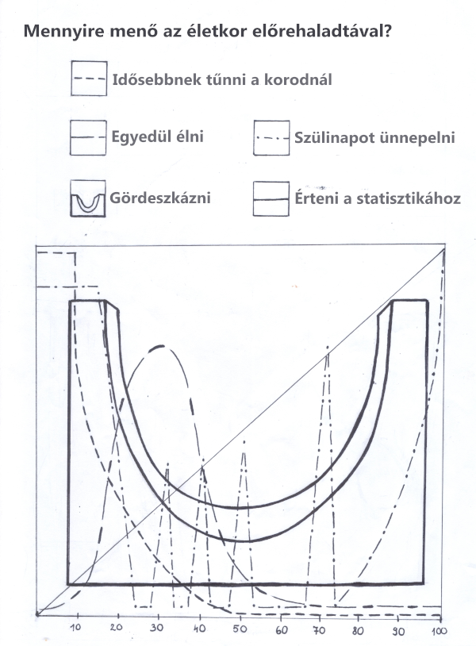

# Grafika az R-ben {#grafika-az-r-ben}

\BeginKnitrBlock{rmdlevel1}
Ebben a fejezetben áttekintjük:
  
* az R grafikus rendszerei
* a hagyományos grafika alapfogalmai
* magasszintű és alacsonyszintű rajzfüggvények a hagyományos grafikában
* a ggplot2 rendszer alapelve
* ábrák létrehozása ggplot2-ben
* ábrák mentése háttértárra
\EndKnitrBlock{rmdlevel1}

