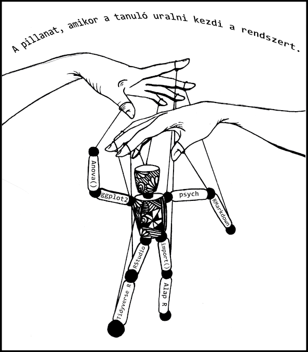

# Publikáció {#publikacio}

## Reprodukálható kutatás

A kutatás és oktatás világában jelentős elmozdulás figyelhető meg a reprodukálható kutatás felé. 

igénye felé.  „Az akadémiai kutatás végső terméke a papír, a laboratóriumi jegyzetfüzetekkel és a teljes számítási környezettel együtt az eredmények előállítása érdekében, mint például a kód, az adatok stb., Amelyek felhasználhatók az eredmények reprodukálására és új munka létrehozására a kutatás ”(Wikipedia).

Ennek következménye az, hogy meg kell változtatnunk szokásainkat, és minden kéziratunkat, előadásainkat, házi feladatainkat stb. Tiszta és reprodukálható formában kell elkezdenünk, azaz ha valaki megadja a kódot, akkor ez a személy pontosan reprodukálhatja a dokumentumot. Ez a dokumentum megkönnyíti ezt az átmenetet az R Markdown segítségével.

